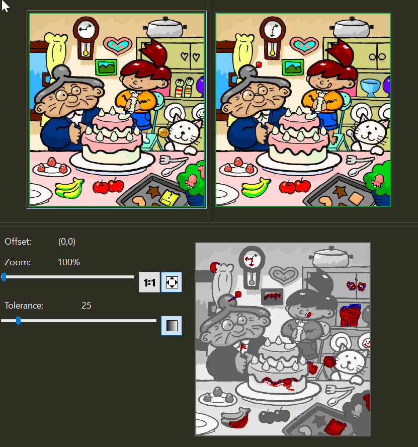

<!--
GENERATED FILE - DO NOT EDIT
This file was generated by [MarkdownSnippets](https://github.com/SimonCropp/MarkdownSnippets).
Source File: /docs/mdsource/binary.source.md
To change this file edit the source file and then run MarkdownSnippets.
-->

# Verification of binary data

Binary data can be verified by passing a stream to `VerifyBinary`.

## XUnit

<!-- snippet: VerifyBinaryXunit -->
<a id='snippet-verifybinaryxunit'/></a>
```cs
public partial class VerifyBase
{
    public Task VerifyBinary(
        Stream input,
        VerifySettings? settings = null)
    {
        return verifier.VerifyBinary(input, settings);
    }

    public Task VerifyBinary(
        IEnumerable<Stream> streams,
        VerifySettings? settings = null)
    {
        return verifier.VerifyBinary(streams, settings);
    }
}
```
<sup><a href='/src/Verify.Xunit/VerifyBase_Stream.cs#L8-L25' title='File snippet `verifybinaryxunit` was extracted from'>snippet source</a> | <a href='#snippet-verifybinaryxunit' title='Navigate to start of snippet `verifybinaryxunit`'>anchor</a></sup>
<!-- endsnippet -->


## NUnit

<!-- snippet: VerifyBinaryNUnit -->
<a id='snippet-verifybinarynunit'/></a>
```cs
public static partial class Verifier
{
    public static async Task VerifyBinary(
        Stream input,
        VerifySettings? settings = null,
        [CallerFilePath] string sourceFile = "")
    {
        using var verifier = BuildVerifier(sourceFile);
        await verifier.VerifyBinary(input, settings);
    }

    public static async Task VerifyBinary(
        IEnumerable<Stream> streams,
        VerifySettings? settings = null,
        [CallerFilePath] string sourceFile = "")
    {
        using var verifier = BuildVerifier(sourceFile);
        await verifier.VerifyBinary(streams, settings);
    }
}
```
<sup><a href='/src/Verify.NUnit/Verifier_Stream.cs#L9-L30' title='File snippet `verifybinarynunit` was extracted from'>snippet source</a> | <a href='#snippet-verifybinarynunit' title='Navigate to start of snippet `verifybinarynunit`'>anchor</a></sup>
<!-- endsnippet -->


## MSTest

<!-- snippet: VerifyBinaryMSTest -->
<a id='snippet-verifybinarymstest'/></a>
```cs
public partial class VerifyBase
{
    public async Task VerifyBinary(
        Stream input,
        VerifySettings? settings = null,
        [CallerFilePath] string sourceFile = "")
    {
        using var verifier = BuildVerifier(sourceFile, settings);
        await verifier.VerifyBinary(input, settings);
    }

    public async Task VerifyBinary(
        IEnumerable<Stream> streams,
        VerifySettings? settings = null,
        [CallerFilePath] string sourceFile = "")
    {
        using var verifier = BuildVerifier(sourceFile, settings);
        await verifier.VerifyBinary(streams, settings);
    }
}
```
<sup><a href='/src/Verify.MSTest/VerifyBase_Stream.cs#L9-L30' title='File snippet `verifybinarymstest` was extracted from'>snippet source</a> | <a href='#snippet-verifybinarymstest' title='Navigate to start of snippet `verifybinarymstest`'>anchor</a></sup>
<!-- endsnippet -->


## DiffTool

A [Diff Tool](diff-tool.md) will only be displayed if one can be found that supports the defined extension.

For example if Beyond Compare is detected the following will be displayed:




## Initial diff

The majority of diff tools require two files to render a diff. When doing the initial verification there is no ".verified." file available. As such when doing the initial verification an "empty file", of the specified extension, will be used. The list of supported empty file can be seen at [EmptyFiles](/src/Verify.Xunit/EmptyFiles). If no empty file can be found for a given extension, then no diff will be displayed.
