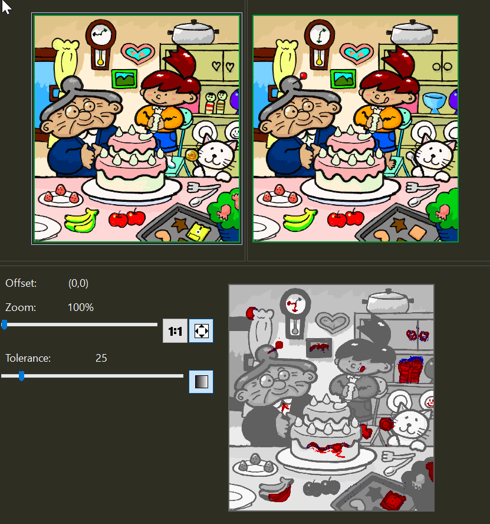

<!--
GENERATED FILE - DO NOT EDIT
This file was generated by [MarkdownSnippets](https://github.com/SimonCropp/MarkdownSnippets).
Source File: /docs/mdsource/binary.source.md
To change this file edit the source file and then run MarkdownSnippets.
-->

# Verification of binary data

Binary data can be verified by passing a stream.

To know how to treat the stream, an extension needs to be provided:

<!-- snippet: StreamWithExtension -->
<a id='snippet-StreamWithExtension'></a>
```cs
[Fact]
public Task StreamWithExtension()
{
    var stream = new MemoryStream(File.ReadAllBytes("sample.png"));
    return Verify(stream, "png");
}
```
<sup><a href='/src/Verify.Tests/StreamTests.cs#L115-L124' title='Snippet source file'>snippet source</a> | <a href='#snippet-StreamWithExtension' title='Start of snippet'>anchor</a></sup>
<!-- endSnippet -->

For a `FileStream` the extension is not required:

<!-- snippet: FileStream -->
<a id='snippet-FileStream'></a>
```cs
[Fact]
public Task FileStream() =>
    Verify(File.OpenRead("sample.txt"));
```
<sup><a href='/src/Verify.Tests/StreamTests.cs#L126-L132' title='Snippet source file'>snippet source</a> | <a href='#snippet-FileStream' title='Start of snippet'>anchor</a></sup>
<!-- endSnippet -->


## DiffTool

A [Diff Tool](https://github.com/VerifyTests/DiffEngine/blob/main/docs/diff-tool.md) will only be displayed if one can be found that supports the defined extension.

For example if Beyond Compare is detected the following will be displayed:




### The `bin` extension

`Verify(byte[])`, when called without an explicit extension, defaults to the `bin` extension. Most diff tools do not register `bin`, so in that case no diff tool will launch. If the bytes are better rendered as text, pass a text extension instead:

```cs
await Verify(bytes, extension: "txt");
```

Note that a text extension causes the content to be compared as text, with line endings normalized. So it will not assert byte level details such as the presence of a byte order mark. Where those details are the subject of the test, `bin` remains the correct extension, and the absence of a diff tool is expected.

A tool can also be registered for `bin`, or for any other extension, via [DiffTools.AddTool](https://github.com/VerifyTests/DiffEngine/blob/main/docs/diff-tool.custom.md).


## Initial diff

The majority of diff tools require two files to render a diff. When doing the initial verification there is no ".verified." file available. As such when doing the initial verification an "empty file", of the specified extension, will be used. The list of supported empty file can be seen at [EmptyFiles](/src/Verify.Xunit/EmptyFiles). If no empty file can be found for a given extension, then no diff will be displayed.
