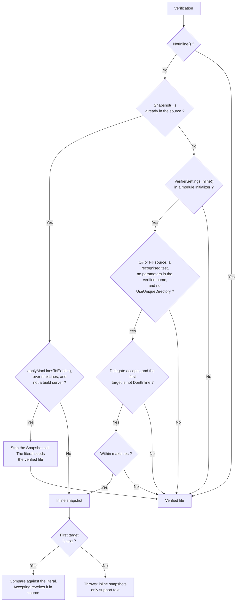

<!--
GENERATED FILE - DO NOT EDIT
This file was generated by [MarkdownSnippets](https://github.com/SimonCropp/MarkdownSnippets).
Source File: /docs/mdsource/inline-snapshots.source.md
To change this file edit the source file and then run MarkdownSnippets.
-->

# Inline Snapshots

**Currently in 32.0.0-beta**

Only C# and F# are supported

If using [DiffEngineTray](https://github.com/VerifyTests/DiffEngine/blob/main/docs/tray.md) ensure to update to the current beta.

Inline snapshots store the expected text inside the test file (.cs, .fs or .fsx) as a raw string literal, next to the code that produces it, instead of in a `.verified.` file on disk.

The [Rider/R# Verify plugin](https://github.com/matkoch/jetbrains-plugin-verify) handles them from 2026.3.0: accepting from the test runner splices the snapshot into the source, and comparing shows the received text against the snapshot the run was measured against.


## Usage

Add `.Snapshot(...)` to any verification:

<!-- snippet: InlineSample -->
<a id='snippet-InlineSample'></a>
```cs
[Fact]
public Task MultiLine()
{
    var input = "line1\nline2";
    return Verify(input)
        .Snapshot(
            """
            line1
            line2
            """);
}
```
<sup><a href='/src/Verify.Tests/InlineTests.cs#L35-L49' title='Snippet source file'>snippet source</a> | <a href='#snippet-InlineSample' title='Start of snippet'>anchor</a></sup>
<!-- endSnippet -->

Omitting the expected argument (or passing `null`) marks the snapshot as new; accepting it writes the literal into the source file.

Because `Snapshot` is a modifier rather than a separate entry point, it composes with every overload: `VerifyXml(...).Snapshot(...)`, `VerifyJson(...).Snapshot(...)`, `VerifyFile(...).Snapshot(...)`, and so on.

[Combinations](combinations.md) are included, since `Combination().Verify(...)` also returns a `SettingsTask`:

<!-- snippet: InlineCombinationSample -->
<a id='snippet-InlineCombinationSample'></a>
```cs
static string Concat(string a, int b) =>
    $"{a}{b}";

[Fact]
public Task Combinations() =>
    Combination()
        .Verify(
            Concat,
            ["a", "b"],
            [1, 2])
        .Snapshot(
            """
            {
              a, 1: a1,
              a, 2: a2,
              b, 1: b1,
              b, 2: b2
            }
            """);
```
<sup><a href='/src/Verify.Tests/InlineTests.cs#L94-L116' title='Snippet source file'>snippet source</a> | <a href='#snippet-InlineCombinationSample' title='Start of snippet'>anchor</a></sup>
<!-- endSnippet -->

The verification pipeline is unchanged: the target is serialized and scrubbed exactly as for file snapshots, then compared against the literal. Line endings in the literal are normalized to `\n` before comparison, whether the source file uses `\r\n`, `\n` or a lone `\r`, so the comparison is not affected by the line endings of the source file.

Multiple inline verifications in a single test method are supported.


## Enabling inline snapshots globally

Most codebases want inline snapshots everywhere rather than one call at a time. Turn them on in a module initializer:

<!-- snippet: StaticInline -->
<a id='snippet-StaticInline'></a>
```cs
public static class ModuleInitializer
{
    [ModuleInitializer]
    public static void Init() =>
        VerifierSettings.Inline();
}
```
<sup><a href='/src/ModuleInitDocs/Inline.cs#L3-L12' title='Snippet source file'>snippet source</a> | <a href='#snippet-StaticInline' title='Start of snippet'>anchor</a></sup>
<!-- endSnippet -->

Every `Verify*` then uses an inline snapshot, unless it is declined by one of the rules below, and accepting one appends the `.Snapshot(...)` call to the verify invocation.

To decide per verification, pass a delegate:

<!-- snippet: StaticInlineDelegate -->
<a id='snippet-StaticInlineDelegate'></a>
```cs
public static class ModuleInitializer
{
    [ModuleInitializer]
    public static void Init() =>
        VerifierSettings.Inline(
            (typeName, methodName, sourceFile, extension) => extension == "txt");
}
```
<sup><a href='/src/ModuleInitDocs/InlineDelegate.cs#L4-L14' title='Snippet source file'>snippet source</a> | <a href='#snippet-StaticInlineDelegate' title='Start of snippet'>anchor</a></sup>
<!-- endSnippet -->

`extension` is that of the target that would be inlined, which is the first one.

Opt a single test out with `.NotInline()`, on either the instance or the fluent settings:

```cs
await Verify(target)
    .NotInline();
```

`NotInline` wins over both the global switch and an explicit `.Snapshot(...)`, with one exception: a `.Snapshot(...)` call combined with `UseUniqueDirectory` throws whether or not `NotInline()` is alongside it.


## Limiting the size of an inline snapshot

A long literal drowns the test method it sits in, which is the opposite of what an inline snapshot is for. `maxLines` keeps those on files:

<!-- snippet: StaticInlineMaxLines -->
<a id='snippet-StaticInlineMaxLines'></a>
```cs
public static class ModuleInitializer
{
    [ModuleInitializer]
    public static void Init() =>
        VerifierSettings.Inline(maxLines: 30);
}
```
<sup><a href='/src/ModuleInitDocs/InlineMaxLines.cs#L3-L12' title='Snippet source file'>snippet source</a> | <a href='#snippet-StaticInlineMaxLines' title='Start of snippet'>anchor</a></sup>
<!-- endSnippet -->

A result of more than 30 lines then uses a `.verified.` file, and everything shorter is inlined.

The limit and the delegate combine as an and: the delegate picks the candidate tests, and the limit applies to what those produce.

`maxLines` counts the lines of the snapshot content, not the lines the literal occupies in source. A raw string literal adds two delimiter lines plus indentation on top of that. A single trailing newline starts no line, so it is not counted. Nothing is measured for width, so a one line snapshot is inlined however long that line is.

By default the limit routes new snapshots only, and a `.Snapshot(...)` call that already exists is left alone. Removing one rewrites source, so that is opted in to separately:

<!-- snippet: StaticInlineApplyMaxLinesToExisting -->
<a id='snippet-StaticInlineApplyMaxLinesToExisting'></a>
```cs
public static class ModuleInitializer
{
    [ModuleInitializer]
    public static void Init() =>
        VerifierSettings.Inline(
            maxLines: 30,
            applyMaxLinesToExisting: true);
}
```
<sup><a href='/src/ModuleInitDocs/InlineApplyMaxLinesToExisting.cs#L3-L14' title='Snippet source file'>snippet source</a> | <a href='#snippet-StaticInlineApplyMaxLinesToExisting' title='Start of snippet'>anchor</a></sup>
<!-- endSnippet -->

Every existing literal over the limit then migrates, not only the ones whose content changed, so a test that was passing keeps passing: the literal seeds the verified file, as described below. Nothing is rewritten on a build server, where such a test keeps using its literal.


## Parameterised tests

An inline snapshot is one literal at one call site, so it cannot hold a different expected value for each case of a [parameterised test](parameterised.md). What decides compatibility is whether the parameters reach the verified name:

 * **Parameters in the verified name**: not inlineable. The [global switch](#enabling-inline-snapshots-globally) declines such a test, which keeps using `.verified.` files, so turning inline on across a codebase leaves data driven tests alone. An explicit `.Snapshot(...)` throws instead, since it is a stated intent that cannot be honoured.
 * **No parameters in the verified name**: inlineable. Every case already shares the one snapshot, which is exactly what a literal can represent.

Constructor arguments are treated the same as method parameters: they form part of the verified name unless ignored.

Dropping the parameters from the verified name therefore opts a parameterised test back in:

<!-- snippet: InlineIgnoreParametersSample -->
<a id='snippet-InlineIgnoreParametersSample'></a>
```cs
[Theory]
[InlineData("a")]
[InlineData("b")]
public Task IgnoredParameters(string value) =>
    Verify(value.Length)
        .IgnoreParameters()
        .Snapshot("1");
```
<sup><a href='/src/Verify.Tests/InlineTests.cs#L289-L299' title='Snippet source file'>snippet source</a> | <a href='#snippet-InlineIgnoreParametersSample' title='Start of snippet'>anchor</a></sup>
<!-- endSnippet -->

The APIs that do this are `IgnoreParameters()`, `IgnoreParametersForVerified()` and `IgnoreConstructorParameters()` on the instance settings, and `VerifierSettings.IgnoreParameters()` and `VerifierSettings.IgnoreConstructorParameters()` globally. Ignoring only some of the parameters is not enough, since the remaining ones still vary the verified name per case. `UseTextForParameters` counts as a parameter here for the same reason, while `UseFileName` pins the verified name so no parameter ever reaches it.

[`NotInline()`](#enabling-inline-snapshots-globally) is the other way out: it keeps a test on files without any of this applying.


## Which target is inlined

The **first** target is the inline snapshot. Any others are written to `.verified.` files as usual, keeping the names they would have had, so turning inline on never renames a snapshot file. That leaves a deliberate gap where the first target's file would have been: a verification that produced `#00`, `#01` and `#02` keeps `#01` and `#02` on disk.

If the first target is not text, the verification throws. `.NotInline()` keeps that test on files. `Target.DontInline` opts an extension out as well, but only where the global switch is what turned inline on: an explicit `.Snapshot(...)` is honoured whatever the target says. A [`maxLines`](#limiting-the-size-of-an-inline-snapshot) limit does not change this: a binary target has no lines to count, so it still reaches the same error rather than quietly falling back to files.


## Extensions that should never inline

A converter that splits one input into several text targets has no sensible first target: inlining the first page of a document and writing the rest to files helps nobody. Such a converter sets `DontInline` on the target that would otherwise be inlined:

```cs
new Target("md", page1)
{
    DontInline = true
}
```

The whole verification then falls back to files.


## How a verification is routed

Every rule above feeds one decision, made per verification once the targets have been serialized and scrubbed:



The checks that route a verification to files are silent rather than errors, so turning the switch on across a codebase leaves the tests it cannot represent alone. An explicit `.Snapshot(...)` is stricter: it throws for parameterised tests and for `UseUniqueDirectory`, since those are a stated intent that cannot be honoured.


## Accepting a snapshot

On a mismatch (or a new snapshot), Verify records the call site (file, line, and the literal's source text via `CallerArgumentExpression`) and produces a patch. Accepting the patch splices a new raw string literal into the source file, preserving the file's encoding, BOM, and line endings. The literal's location is found by content search, so line shifts from earlier edits do not break later ones.

Accept mechanisms:

 * **AutoVerify**: with [AutoVerify](autoverify.md) enabled, the source file is rewritten immediately during the test run.
 * **[DiffEngineViewer](https://github.com/VerifyTests/DiffEngine/blob/main/docs/viewer.md)**: opens showing the received text against the expected text, with Accept and Discard. It ships inside the DiffEngine package, so it needs no install, and it runs on Windows, macOS and Linux. Several snapshots failing in one run queue into a single window.
 * **[DiffEngineTray](https://github.com/VerifyTests/DiffEngine/blob/main/docs/tray.md)**: pending snapshots appear under "Pending Snapshots" and can be accepted, discarded, or opened in the viewer.

The queue belongs to whichever process bound the port first, which is normally the tray since it starts at login. Whichever holds it, the other drives it over the same socket, so the two always agree about what is pending.

Nothing is written to disk for a pending inline snapshot: the patch is handed to the queue owner. Only when nothing owns a queue does Verify fall back to staging the received text, the expected text and the patch itself under `obj/VerifyInline/`, and launching whatever diff tool is configured.

On a build server, no source rewriting, review or staging occurs; the failure exception carries the full content.


## F#

F# test files (`.fs`, `.fsx`) work the same way, with one difference worth knowing because it decides what a literal means.

C# has raw strings: the compiler drops the line break after the opening delimiter and the indentation the closing delimiter sits at, and hands over the snapshot. F# has no such form. A triple-quoted string is verbatim, so what F# hands over still carries that line break and the indentation of every line. Writing the snapshot at the left margin instead is not an option either, since F#'s offside rule then rejects anything ending in a newline.

So the layout is taken off by agreement rather than by the compiler. Verify writes the shape C# would, and reads it back the same way:

<!-- snippet: InlineFSharpAccept -->
<a id='snippet-InlineFSharpAccept'></a>
```cs
[Fact]
public async Task AcceptWritesTheIndentedForm()
{
    var template = WriteTemplate(
        """
        module Tests

        let MyTest () =
            Verifier.Verify(value).Snapshot("old").ToTask()
        """);
    try
    {
        var settings = new VerifySettings();
        settings.IgnoreParameters();
        settings.Snapshot("old", template, 4, null, "MyTest");
        settings.AutoVerify();
        settings.DisableDiff();

        await Verify("line one\nline two", settings);

        Assert.Equal(
            """"
            module Tests

            let MyTest () =
                Verifier.Verify(value).Snapshot(
                    """
                    line one
                    line two
                    """).ToTask()
            """",
            await File.ReadAllTextAsync(template));
    }
    finally
    {
        Directory.Delete(Path.GetDirectoryName(template)!, true);
    }
}
```
<sup><a href='/src/Verify.Tests/InlineFSharpTests.cs#L125-L164' title='Snippet source file'>snippet source</a> | <a href='#snippet-InlineFSharpAccept' title='Start of snippet'>anchor</a></sup>
<!-- endSnippet -->

Which means a literal like that compares as the snapshot it looks like, rather than as the indented text F# produced:

<!-- snippet: InlineFSharpMatches -->
<a id='snippet-InlineFSharpMatches'></a>
```cs
[Fact]
public Task LayoutIsNotContent()
{
    var settings = new VerifySettings();
    settings.IgnoreParameters();
    settings.Snapshot(asFSharpHandsItOver, FakeSource(), 1, null, "LayoutIsNotContent");
    return Verify("line one\nline two", settings);
}
```
<sup><a href='/src/Verify.Tests/InlineFSharpTests.cs#L66-L75' title='Snippet source file'>snippet source</a> | <a href='#snippet-InlineFSharpMatches' title='Start of snippet'>anchor</a></sup>
<!-- endSnippet -->

Two consequences. Content ending in a newline is written as a blank line before the closing delimiter, exactly as in C#. And an F# `expected` argument is only the snapshot once Verify has read it: look at it any other way, in a debugger or by passing it somewhere else, and it still has its indentation.

Two further differences need nothing from the reader. F# does not implement `CallerArgumentExpression` (it warns FS0202), so a patch is anchored by the previous snapshot's value and by `CallerMemberName` rather than by the literal's source text. And `Snapshot` returns the `SettingsTask`, so an accepted snapshot is written in front of the `ToTask()` an F# test ends its chain with.


## Moving between file and inline snapshots

Both directions are handled without any manual file editing.

**File to inline.** The existing `.verified.` file for the inlined target is detected as stale and flows through the standard [Delete handling](exception-message-format.md): deleted automatically under AutoVerify, otherwise listed in the `Delete:` section and pended for review. A pending delete goes to the tray when one is running, and to the queue owner otherwise, so it is reviewable with no tray installed. Files belonging to the other targets keep their names and are left alone.

There is no size opt out on this direction, so a snapshot that shrinks back under a [`maxLines`](#limiting-the-size-of-an-inline-snapshot) limit returns to being inline and leaves its file behind as a stale delete. One sitting on the boundary therefore moves each time it crosses it.

**Inline to file.** When a `.Snapshot(...)` call exists but inline is off for that verification, the call is removed from the source and the snapshot runs as a normal file snapshot. The literal was the approved snapshot, so it seeds the verified file: an unchanged snapshot migrates without failing, and a changed one is an ordinary mismatch with the old and new text, accepted the usual way. Accepting a migration means committing both the source edit and the new `.verified.` file.

The two triggers for this direction are `.NotInline()` and an existing literal over a [`maxLines`](#limiting-the-size-of-an-inline-snapshot) limit.


## Exception message

Inline failures use the `InlineNew:` and `InlineNotEqual:` sections of the [exception message format](exception-message-format.md), and can be parsed with the Verify.ExceptionParsing package. Because only the first target is inlined, one message can carry both an inline section and the file sections for the remaining targets.
