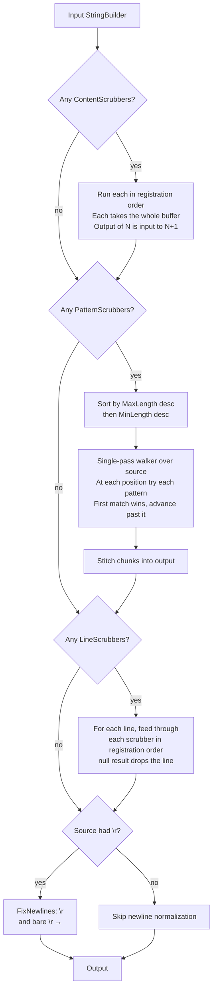

# Scrubbers

Scrubbers run on the final string before doing the verification action.

Multiple scrubbers [can be defined at multiple levels](#Scrubber-levels).

The scrubber engine sorts pattern scrubbers by their `MaxLength` descending, runs line scrubbers in registration order after the pattern pass, and runs content scrubbers first. See the [scrubber migration guide](scrubber-migration.md) for details on the new API and how to migrate from the legacy `Action<StringBuilder>` form.

Scrubbers can be added multiple times to have them execute multiple times. This can be helpful when compounding multiple scrubbers together.


## Pipeline

A scrub runs three phases in fixed order. Within a phase the per-scrubber rules differ — content scrubbers chain in registration order, pattern scrubbers compete by length and claim ranges, line scrubbers chain per-line.



### Chunk walker

Pattern scrubbers do not rewrite the buffer in place. The walker reads the source span once and emits a sequence of chunks — passthrough ranges into the source, or replacement strings — which get stitched into a fresh buffer at the end.

```
Source:  Id: 173535ae-995b-4cc6-a74e-8cd4be57039c done
         ^^^^                                    ^^^^^
         pass                                    pass
             ^^^^^^^^^^^^^^^^^^^^^^^^^^^^^^^^^^^^
             36-char Guid → replacement "Guid_1"

Walker emits chunks:
  [Passthrough  start=0   len=4 ]   "Id: "
  [Replacement  "Guid_1"        ]   pattern matched at i=4, len=36, advance i to 40
  [Passthrough  start=40  len=5 ]   " done"

Stitch (single sequential append into output):
  "Id: " + "Guid_1" + " done"  →  "Id: Guid_1 done"
```

A pattern scrubber declares `MinLength` / `MaxLength` of the substring it can match. Inputs (or lines, when `SingleLine` is true) shorter than the smallest `MinLength` skip the walker entirely. Each `TryMatch` call gets a slice no longer than that scrubber's `MaxLength`.

### Pattern overlap

When two patterns can both match at the same position, the longer one wins. The pre-walk sort by `MaxLength` descending makes that automatic, and the claim-once rule means the second pattern is never even consulted at a position the first claimed.

```
Two patterns registered:
  A: matches literal "ab"   replacement "{SHORT}"  MaxLength=2
  B: matches literal "abcd" replacement "{LONG}"   MaxLength=4

Input:    a b c d
Position: 0 1 2 3

Sort by MaxLength desc → walker tries patterns in order [B, A]

At i=0:
  B.TryMatch("abcd") → match, emit "{LONG}", advance i to 4   ← claimed
  A is NOT consulted at i=0 (claim-once)
At i=4: end of input

Output: "{LONG}"
```

If the order were reversed, A would claim "ab" and the longer match would be lost. The `MaxLength`-desc ordering makes overlapping patterns deterministic regardless of registration order.


## Available Scrubbers

Scrubbers can be added to an instance of `VerifySettings` or globally on `VerifierSettings`.


### Directory Scrubbers

 * The current solution directory will be replaced with `{SolutionDirectory}`. To disable use `VerifierSettings.DontScrubSolutionDirectory()` in a module initializer. See [solution Discovery](solution-discovery.md)
 * The current project directory will be replaced with `{ProjectDirectory}`. To disable use `VerifierSettings.DontScrubProjectDirectory()` in a module initializer.
 * On Windows, the current [user profile](https://learn.microsoft.com/en-us/dotnet/api/system.environment.specialfolder) will be replaced with `{UserProfile}`. To disable use `VerifierSettings.DontScrubUserProfile()` in a module initializer.
 * The `AppDomain.CurrentDomain.BaseDirectory` will be replaced with `{CurrentDirectory}`.
 * The `Assembly.CodeBase` will be replaced with `{CurrentDirectory}`.
 * The `Path.GetTempPath()` will be replaced with `{TempPath}`.


#### Attribute data

The solution and project directory replacement functionality is achieved by adding attributes to the target assembly at compile time. For any project that references Verify, the following attributes will be added:

```
[assembly: AssemblyMetadata("Verify.ProjectDirectory", "C:\Code\TheSolution\Project\")]
[assembly: AssemblyMetadata("Verify.SolutionDirectory", "C:\Code\TheSolution\")]
```

This information can be useful to consumers when writing tests, so it is exposed via `AttributeReader`:

 * Project directory for an assembly: `AttributeReader.GetProjectDirectory(assembly)`
 * Project directory for the current executing assembly: `AttributeReader.GetProjectDirectory()`
 * Solution directory for an assembly: `AttributeReader.GetSolutionDirectory(assembly)`
 * Solution directory for the current executing assembly: `AttributeReader.GetSolutionDirectory()`


### ScrubLines

Allows lines to be selectively removed using a `Func`.

For example remove lines containing `text`:

snippet: ScrubLines


### ScrubLinesContaining

Remove all lines containing any of the defined strings.

For example remove lines containing `text1` or `text2`

snippet: ScrubLinesContaining

Case insensitive by default (`StringComparison.OrdinalIgnoreCase`).

`StringComparison` can be overridden:

snippet: ScrubLinesContainingOrdinal


### ScrubLinesWithReplace

Allows lines to be selectively replaced using a `Func`.

For example converts lines to upper case:

snippet: ScrubLinesWithReplace


### ScrubMachineName

Replaces `Environment.MachineName` with `TheMachineName`.

snippet: ScrubMachineName


### ScrubUserName

Replaces `Environment.UserName` with `TheUserName`.

snippet: ScrubUserName


### AddScrubber

Adds a scrubber with full control over the text via a `Func`


## DisableScrubbers

Given the following target

snippet: DisableScrubbersTarget

When scrubbers are disabled the result will be:

snippet: DisableScrubbersTests/Tests.Instance.verified.txt


### Instance

snippet: DisableScrubbers


### Fluent

snippet: DisableScrubbersFluent


## More complete example


### NUnit

snippet: ScrubbersSampleNUnit


### xUnit

snippet: ScrubbersSampleXunit


### Fixie

snippet: ScrubbersSampleFixie


### MSTest

snippet: ScrubbersSampleMSTest


### TUnit

snippet: ScrubbersSampleTUnit


### Results

snippet: Verify.XunitV3.Tests/Scrubbers/ScrubbersSample.Lines.verified.txt


## Scrubber levels

Scrubbers can be defined at three levels:

 * Method: Will run the verification in the current test method.
 * Class: As a class level 'VerifySettings' field then re-used at the method level.
 * Global: Will run for test methods on all tests.


### NUnit

snippet: ScrubberLevelsSampleNUnit


### xUnit

snippet: ScrubberLevelsSampleXunit


### Fixie

snippet: ScrubberLevelsSampleFixie


### MSTest

snippet: ScrubberLevelsSampleMSTest


### TUnit

snippet: ScrubberLevelsSampleTUnit


### Result

snippet: Verify.XunitV3.Tests/Scrubbers/ScrubberLevelsSample.Usage.verified.txt


## See also

 * [Guid behavior](guids.md)
 * [Date behavior](dates.md)
 * [Numeric Ids](numeric-ids.md)
 * [Solution Discovery](solution-discovery.md)
