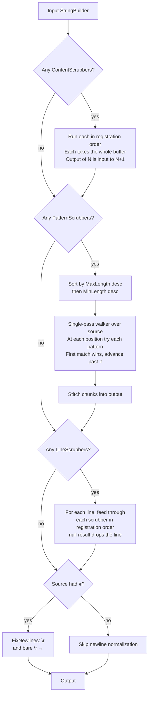

<!--
GENERATED FILE - DO NOT EDIT
This file was generated by [MarkdownSnippets](https://github.com/SimonCropp/MarkdownSnippets).
Source File: /docs/mdsource/scrubbers.source.md
To change this file edit the source file and then run MarkdownSnippets.
-->

# Scrubbers

Scrubbers run on the final string before doing the verification action.

Multiple scrubbers [can be defined at multiple levels](#Scrubber-levels).

The scrubber engine sorts pattern scrubbers by their `MaxLength` descending, runs line scrubbers in registration order after the pattern pass, and runs content scrubbers first. See the [scrubber migration guide](scrubber-migration.md) for details on the new API and how to migrate from the legacy `Action<StringBuilder>` form.

Scrubbers can be added multiple times to have them execute multiple times. This can be helpful when compounding multiple scrubbers together.


## Pipeline

A scrub runs three phases in fixed order. Within a phase the per-scrubber rules differ — content scrubbers chain in registration order, pattern scrubbers compete by length and claim ranges, line scrubbers chain per-line.



### Chunk walker

Pattern scrubbers do not rewrite the buffer in place. The walker reads the source span once and emits a sequence of chunks — passthrough ranges into the source, or replacement strings — which get stitched into a fresh buffer at the end.

```
Source:  Id: 173535ae-995b-4cc6-a74e-8cd4be57039c done
         ^^^^                                    ^^^^^
         pass                                    pass
             ^^^^^^^^^^^^^^^^^^^^^^^^^^^^^^^^^^^^
             36-char Guid → replacement "Guid_1"

Walker emits chunks:
  [Passthrough  start=0   len=4 ]   "Id: "
  [Replacement  "Guid_1"        ]   pattern matched at i=4, len=36, advance i to 40
  [Passthrough  start=40  len=5 ]   " done"

Stitch (single sequential append into output):
  "Id: " + "Guid_1" + " done"  →  "Id: Guid_1 done"
```

A pattern scrubber declares `MinLength` / `MaxLength` of the substring it can match. Inputs (or lines, when `SingleLine` is true) shorter than the smallest `MinLength` skip the walker entirely. Each `TryMatch` call gets a slice no longer than that scrubber's `MaxLength`.

### Pattern overlap

When two patterns can both match at the same position, the longer one wins. The pre-walk sort by `MaxLength` descending makes that automatic, and the claim-once rule means the second pattern is never even consulted at a position the first claimed.

```
Two patterns registered:
  A: matches literal "ab"   replacement "{SHORT}"  MaxLength=2
  B: matches literal "abcd" replacement "{LONG}"   MaxLength=4

Input:    a b c d
Position: 0 1 2 3

Sort by MaxLength desc → walker tries patterns in order [B, A]

At i=0:
  B.TryMatch("abcd") → match, emit "{LONG}", advance i to 4   ← claimed
  A is NOT consulted at i=0 (claim-once)
At i=4: end of input

Output: "{LONG}"
```

If the order were reversed, A would claim "ab" and the longer match would be lost. The `MaxLength`-desc ordering makes overlapping patterns deterministic regardless of registration order.


## Available Scrubbers

Scrubbers can be added to an instance of `VerifySettings` or globally on `VerifierSettings`.


### Directory Scrubbers

 * The current solution directory will be replaced with `{SolutionDirectory}`. To disable use `VerifierSettings.DontScrubSolutionDirectory()` in a module initializer. See [solution Discovery](solution-discovery.md)
 * The current project directory will be replaced with `{ProjectDirectory}`. To disable use `VerifierSettings.DontScrubProjectDirectory()` in a module initializer.
 * On Windows, the current [user profile](https://learn.microsoft.com/en-us/dotnet/api/system.environment.specialfolder) will be replaced with `{UserProfile}`. To disable use `VerifierSettings.DontScrubUserProfile()` in a module initializer.
 * The `AppDomain.CurrentDomain.BaseDirectory` will be replaced with `{CurrentDirectory}`.
 * The `Assembly.CodeBase` will be replaced with `{CurrentDirectory}`.
 * The `Path.GetTempPath()` will be replaced with `{TempPath}`.


#### Attribute data

The solution and project directory replacement functionality is achieved by adding attributes to the target assembly at compile time. For any project that references Verify, the following attributes will be added:

```
[assembly: AssemblyMetadata("Verify.ProjectDirectory", "C:\Code\TheSolution\Project\")]
[assembly: AssemblyMetadata("Verify.SolutionDirectory", "C:\Code\TheSolution\")]
```

This information can be useful to consumers when writing tests, so it is exposed via `AttributeReader`:

 * Project directory for an assembly: `AttributeReader.GetProjectDirectory(assembly)`
 * Project directory for the current executing assembly: `AttributeReader.GetProjectDirectory()`
 * Solution directory for an assembly: `AttributeReader.GetSolutionDirectory(assembly)`
 * Solution directory for the current executing assembly: `AttributeReader.GetSolutionDirectory()`


### ScrubLines

Allows lines to be selectively removed using a `Func`.

For example remove lines containing `text`:

<!-- snippet: ScrubLines -->
<a id='snippet-ScrubLines'></a>
```cs
verifySettings.ScrubLines(static (ReadOnlySpan<char> line) => line.Contains("text", StringComparison.Ordinal));
```
<sup><a href='/src/Verify.Tests/Serialization/SerializationTests.cs#L2031-L2035' title='Snippet source file'>snippet source</a> | <a href='#snippet-ScrubLines' title='Start of snippet'>anchor</a></sup>
<!-- endSnippet -->


### ScrubLinesContaining

Remove all lines containing any of the defined strings.

For example remove lines containing `text1` or `text2`

<!-- snippet: ScrubLinesContaining -->
<a id='snippet-ScrubLinesContaining'></a>
```cs
verifySettings.ScrubLinesContaining("text1", "text2");
```
<sup><a href='/src/Verify.Tests/Serialization/SerializationTests.cs#L2037-L2041' title='Snippet source file'>snippet source</a> | <a href='#snippet-ScrubLinesContaining' title='Start of snippet'>anchor</a></sup>
<!-- endSnippet -->

Case insensitive by default (`StringComparison.OrdinalIgnoreCase`).

`StringComparison` can be overridden:

<!-- snippet: ScrubLinesContainingOrdinal -->
<a id='snippet-ScrubLinesContainingOrdinal'></a>
```cs
verifySettings.ScrubLinesContaining(StringComparison.Ordinal, "text1", "text2");
```
<sup><a href='/src/Verify.Tests/Serialization/SerializationTests.cs#L2043-L2047' title='Snippet source file'>snippet source</a> | <a href='#snippet-ScrubLinesContainingOrdinal' title='Start of snippet'>anchor</a></sup>
<!-- endSnippet -->


### ScrubLinesWithReplace

Allows lines to be selectively replaced using a `Func`.

For example converts lines to upper case:

<!-- snippet: ScrubLinesWithReplace -->
<a id='snippet-ScrubLinesWithReplace'></a>
```cs
verifySettings.ScrubLinesWithReplace(static (ReadOnlySpan<char> line) => line.ToString().ToUpper());
```
<sup><a href='/src/Verify.Tests/Serialization/SerializationTests.cs#L2049-L2053' title='Snippet source file'>snippet source</a> | <a href='#snippet-ScrubLinesWithReplace' title='Start of snippet'>anchor</a></sup>
<!-- endSnippet -->


### ScrubMachineName

Replaces `Environment.MachineName` with `TheMachineName`.

<!-- snippet: ScrubMachineName -->
<a id='snippet-ScrubMachineName'></a>
```cs
verifySettings.ScrubMachineName();
```
<sup><a href='/src/Verify.Tests/Serialization/SerializationTests.cs#L2055-L2059' title='Snippet source file'>snippet source</a> | <a href='#snippet-ScrubMachineName' title='Start of snippet'>anchor</a></sup>
<!-- endSnippet -->


### ScrubUserName

Replaces `Environment.UserName` with `TheUserName`.

<!-- snippet: ScrubUserName -->
<a id='snippet-ScrubUserName'></a>
```cs
verifySettings.ScrubUserName();
```
<sup><a href='/src/Verify.Tests/Serialization/SerializationTests.cs#L2061-L2065' title='Snippet source file'>snippet source</a> | <a href='#snippet-ScrubUserName' title='Start of snippet'>anchor</a></sup>
<!-- endSnippet -->


### AddScrubber

Adds a scrubber with full control over the text via a `Func`


## DisableScrubbers

Given the following target

<!-- snippet: DisableScrubbersTarget -->
<a id='snippet-DisableScrubbersTarget'></a>
```cs
static object BuildTarget() =>
    new Target(
        "C:/Code/TheSolution",
        "C:/Code/TheSolution/TheProject",
        new Date(2020, 1, 1),
        new DateTime(2020, 1, 1),
        new DateTimeOffset(2020, 1, 1, 1, 1, 1, TimeSpan.FromHours(10)),
        new Guid("ae8529a6-30a0-46e2-b7d6-9fcb7b23463c"));
```
<sup><a href='/src/DisableScrubbersTests/Tests.cs#L111-L122' title='Snippet source file'>snippet source</a> | <a href='#snippet-DisableScrubbersTarget' title='Start of snippet'>anchor</a></sup>
<!-- endSnippet -->

When scrubbers are disabled the result will be:

<!-- snippet: DisableScrubbersTests/Tests.Instance.verified.txt -->
<a id='snippet-DisableScrubbersTests/Tests.Instance.verified.txt'></a>
```txt
{
  TheSolutionDir: C:/Code/TheSolution,
  TheProjectDir: C:/Code/TheSolution/TheProject,
  Date: 2020-01-01,
  DateTime: 2020-01-01,
  DateTimeOffset: 2020-01-01 01:01:01 +10,
  Guid: ae8529a6-30a0-46e2-b7d6-9fcb7b23463c
}
```
<sup><a href='/src/DisableScrubbersTests/Tests.Instance.verified.txt#L1-L8' title='Snippet source file'>snippet source</a> | <a href='#snippet-DisableScrubbersTests/Tests.Instance.verified.txt' title='Start of snippet'>anchor</a></sup>
<!-- endSnippet -->


### Instance

<!-- snippet: DisableScrubbers -->
<a id='snippet-DisableScrubbers'></a>
```cs
[Fact]
public Task Instance()
{
    var settings = new VerifySettings();
    settings.DisableScrubbers();
    return Verify(BuildTarget(), settings);
}
```
<sup><a href='/src/DisableScrubbersTests/Tests.cs#L9-L19' title='Snippet source file'>snippet source</a> | <a href='#snippet-DisableScrubbers' title='Start of snippet'>anchor</a></sup>
<!-- endSnippet -->


### Fluent

<!-- snippet: DisableScrubbersFluent -->
<a id='snippet-DisableScrubbersFluent'></a>
```cs
[Fact]
public Task Fluent() =>
    Verify(BuildTarget())
        .DisableScrubbers();
```
<sup><a href='/src/DisableScrubbersTests/Tests.cs#L21-L28' title='Snippet source file'>snippet source</a> | <a href='#snippet-DisableScrubbersFluent' title='Start of snippet'>anchor</a></sup>
<!-- endSnippet -->


## More complete example


### NUnit

<!-- snippet: ScrubbersSampleNUnit -->
<a id='snippet-ScrubbersSampleNUnit'></a>
```cs
[TestFixture]
public class ScrubbersSample
{
    [Test]
    public Task Lines()
    {
        var settings = new VerifySettings();
        settings.ScrubLinesWithReplace(
            replaceLine: (ReadOnlySpan<char> line) =>
            {
                if (line.Contains("LineE", StringComparison.Ordinal))
                {
                    return "NoMoreLineE";
                }

                return line.ToString();
            });
        settings.ScrubLines(removeLine: (ReadOnlySpan<char> line) => line.IndexOf('J') != -1);
        settings.ScrubLinesContaining("b", "D");
        settings.ScrubLinesContaining(StringComparison.Ordinal, "H");
        return Verify(
            settings: settings,
            target: """
                    LineA
                    LineB
                    LineC
                    LineD
                    LineE
                    LineH
                    LineI
                    LineJ
                    """);
    }

    [Test]
    public Task LinesFluent() =>
        Verify("""
               LineA
               LineB
               LineC
               LineD
               LineE
               LineH
               LineI
               LineJ
               """)
            .ScrubLinesWithReplace(
                replaceLine: (ReadOnlySpan<char> line) =>
                {
                    if (line.Contains("LineE", StringComparison.Ordinal))
                    {
                        return "NoMoreLineE";
                    }

                    return line.ToString();
                })
            .ScrubLines(removeLine: (ReadOnlySpan<char> line) => line.IndexOf('J') != -1)
            .ScrubLinesContaining("b", "D")
            .ScrubLinesContaining(StringComparison.Ordinal, "H");

    [Test]
    public Task RemoveOrReplace() =>
        Verify("""
               LineA
               LineB
               LineC
               """)
            .ScrubLinesWithReplace(
                replaceLine: (ReadOnlySpan<char> line) =>
                {
                    if (line.Contains("LineB", StringComparison.Ordinal))
                    {
                        return null;
                    }

                    return line.ToString().ToLower();
                });

    [Test]
    public Task EmptyLines() =>
        Verify("""

               LineA

               LineC

               """)
            .ScrubEmptyLines();
}
```
<sup><a href='/src/Verify.NUnit.Tests/Scrubbers/ScrubbersSample.cs#L1-L93' title='Snippet source file'>snippet source</a> | <a href='#snippet-ScrubbersSampleNUnit' title='Start of snippet'>anchor</a></sup>
<!-- endSnippet -->


### xUnit

<!-- snippet: ScrubbersSampleXunit -->
<a id='snippet-ScrubbersSampleXunit'></a>
```cs
public class ScrubbersSample
{
    [Fact]
    public Task Lines()
    {
        var settings = new VerifySettings();
        settings.ScrubLinesWithReplace(
            replaceLine: (ReadOnlySpan<char> line) =>
            {
                if (line.Contains("LineE", StringComparison.Ordinal))
                {
                    return "NoMoreLineE";
                }

                return line.ToString();
            });
        settings.ScrubLines(removeLine: (ReadOnlySpan<char> line) => line.IndexOf('J') != -1);
        settings.ScrubLinesContaining("b", "D");
        settings.ScrubLinesContaining(StringComparison.Ordinal, "H");
        return Verify(
            settings: settings,
            target: """
                    LineA
                    LineB
                    LineC
                    LineD
                    LineE
                    LineH
                    LineI
                    LineJ
                    """);
    }

    [Fact]
    public Task EmptyLine()
    {
        var settings = new VerifySettings();
        settings.ScrubLinesWithReplace(
            replaceLine: (ReadOnlySpan<char> _) => "");
        return Verify(
            settings: settings,
            target: "");
    }

    [Fact]
    public Task LinesFluent() =>
        Verify("""
               LineA
               LineB
               LineC
               LineD
               LineE
               LineH
               LineI
               LineJ
               """)
            .ScrubLinesWithReplace(
                replaceLine: (ReadOnlySpan<char> line) =>
                {
                    if (line.Contains("LineE", StringComparison.Ordinal))
                    {
                        return "NoMoreLineE";
                    }

                    return line.ToString();
                })
            .ScrubLines(removeLine: (ReadOnlySpan<char> line) => line.IndexOf('J') != -1)
            .ScrubLinesContaining("b", "D")
            .ScrubLinesContaining(StringComparison.Ordinal, "H");

    [Fact]
    public Task RemoveOrReplace() =>
        Verify("""
               LineA
               LineB
               LineC
               """)
            .ScrubLinesWithReplace(
                replaceLine: (ReadOnlySpan<char> line) =>
                {
                    if (line.Contains("LineB", StringComparison.Ordinal))
                    {
                        return null;
                    }

                    return line.ToString().ToLower();
                });

    [Fact]
    public Task EmptyLines() =>
        Verify("""

               LineA

               LineC

               """)
            .ScrubEmptyLines();
}
```
<sup><a href='/src/Verify.XunitV3.Tests/Scrubbers/ScrubbersSample.cs#L1-L103' title='Snippet source file'>snippet source</a> | <a href='#snippet-ScrubbersSampleXunit' title='Start of snippet'>anchor</a></sup>
<!-- endSnippet -->


### Fixie

<!-- snippet: ScrubbersSampleFixie -->
<a id='snippet-ScrubbersSampleFixie'></a>
```cs
public class ScrubbersSample
{
    public Task Lines()
    {
        var settings = new VerifySettings();
        settings.ScrubLinesWithReplace(
            replaceLine: (ReadOnlySpan<char> line) =>
            {
                if (line.Contains("LineE", StringComparison.Ordinal))
                {
                    return "NoMoreLineE";
                }

                return line.ToString();
            });
        settings.ScrubLines(removeLine: (ReadOnlySpan<char> line) => line.IndexOf('J') != -1);
        settings.ScrubLinesContaining("b", "D");
        settings.ScrubLinesContaining(StringComparison.Ordinal, "H");
        return Verify(
            settings: settings,
            target: """
                    LineA
                    LineB
                    LineC
                    LineD
                    LineE
                    LineH
                    LineI
                    LineJ
                    """);
    }

    public Task LinesFluent() =>
        Verify("""
               LineA
               LineB
               LineC
               LineD
               LineE
               LineH
               LineI
               LineJ
               """)
            .ScrubLinesWithReplace(
                replaceLine: (ReadOnlySpan<char> line) =>
                {
                    if (line.Contains("LineE", StringComparison.Ordinal))
                    {
                        return "NoMoreLineE";
                    }

                    return line.ToString();
                })
            .ScrubLines(removeLine: (ReadOnlySpan<char> line) => line.IndexOf('J') != -1)
            .ScrubLinesContaining("b", "D")
            .ScrubLinesContaining(StringComparison.Ordinal, "H");

    public Task RemoveOrReplace() =>
        Verify("""
               LineA
               LineB
               LineC
               """)
            .ScrubLinesWithReplace(
                replaceLine: (ReadOnlySpan<char> line) =>
                {
                    if (line.Contains("LineB", StringComparison.Ordinal))
                    {
                        return null;
                    }

                    return line.ToString().ToLower();
                });

    public Task EmptyLines() =>
        Verify("""

               LineA

               LineC

               """)
            .ScrubEmptyLines();
}
```
<sup><a href='/src/Verify.Fixie.Tests/Scrubbers/ScrubbersSample.cs#L1-L88' title='Snippet source file'>snippet source</a> | <a href='#snippet-ScrubbersSampleFixie' title='Start of snippet'>anchor</a></sup>
<!-- endSnippet -->


### MSTest

<!-- snippet: ScrubbersSampleMSTest -->
<a id='snippet-ScrubbersSampleMSTest'></a>
```cs
[TestClass]
public partial class ScrubbersSample
{
    [TestMethod]
    public Task Lines()
    {
        var settings = new VerifySettings();
        settings.ScrubLinesWithReplace(
            replaceLine: (ReadOnlySpan<char> line) =>
            {
                if (line.Contains("LineE", StringComparison.Ordinal))
                {
                    return "NoMoreLineE";
                }

                return line.ToString();
            });
        settings.ScrubLines(removeLine: (ReadOnlySpan<char> line) => line.IndexOf('J') != -1);
        settings.ScrubLinesContaining("b", "D");
        settings.ScrubLinesContaining(StringComparison.Ordinal, "H");
        return Verify(
            settings: settings,
            target: """
                    LineA
                    LineB
                    LineC
                    LineD
                    LineE
                    LineH
                    LineI
                    LineJ
                    """);
    }

    [TestMethod]
    public Task LinesFluent() =>
        Verify("""
               LineA
               LineB
               LineC
               LineD
               LineE
               LineH
               LineI
               LineJ
               """)
            .ScrubLinesWithReplace(
                replaceLine: (ReadOnlySpan<char> line) =>
                {
                    if (line.Contains("LineE", StringComparison.Ordinal))
                    {
                        return "NoMoreLineE";
                    }

                    return line.ToString();
                })
            .ScrubLines(removeLine: (ReadOnlySpan<char> line) => line.IndexOf('J') != -1)
            .ScrubLinesContaining("b", "D")
            .ScrubLinesContaining(StringComparison.Ordinal, "H");

    [TestMethod]
    public Task RemoveOrReplace() =>
        Verify("""
               LineA
               LineB
               LineC
               """)
            .ScrubLinesWithReplace(
                replaceLine: (ReadOnlySpan<char> line) =>
                {
                    if (line.Contains("LineB", StringComparison.Ordinal))
                    {
                        return null;
                    }

                    return line.ToString().ToLower();
                });

    [TestMethod]
    public Task EmptyLines() =>
        Verify("""

               LineA

               LineC

               """)
            .ScrubEmptyLines();
}
```
<sup><a href='/src/Verify.MSTest.Tests/Scrubbers/ScrubbersSample.cs#L1-L93' title='Snippet source file'>snippet source</a> | <a href='#snippet-ScrubbersSampleMSTest' title='Start of snippet'>anchor</a></sup>
<!-- endSnippet -->


### TUnit

<!-- snippet: ScrubbersSampleTUnit -->
<a id='snippet-ScrubbersSampleTUnit'></a>
```cs
public class ScrubbersSample
{
    [Test]
    public Task Lines()
    {
        var settings = new VerifySettings();
        settings.ScrubLinesWithReplace(
            replaceLine: (ReadOnlySpan<char> line) =>
            {
                if (line.Contains("LineE", StringComparison.Ordinal))
                {
                    return "NoMoreLineE";
                }

                return line.ToString();
            });
        settings.ScrubLines(removeLine: (ReadOnlySpan<char> line) => line.IndexOf('J') != -1);
        settings.ScrubLinesContaining("b", "D");
        settings.ScrubLinesContaining(StringComparison.Ordinal, "H");
        return Verify(
            settings: settings,
            target: """
                    LineA
                    LineB
                    LineC
                    LineD
                    LineE
                    LineH
                    LineI
                    LineJ
                    """);
    }

    [Test]
    public Task LinesFluent() =>
        Verify("""
               LineA
               LineB
               LineC
               LineD
               LineE
               LineH
               LineI
               LineJ
               """)
            .ScrubLinesWithReplace(
                replaceLine: (ReadOnlySpan<char> line) =>
                {
                    if (line.Contains("LineE", StringComparison.Ordinal))
                    {
                        return "NoMoreLineE";
                    }

                    return line.ToString();
                })
            .ScrubLines(removeLine: (ReadOnlySpan<char> line) => line.IndexOf('J') != -1)
            .ScrubLinesContaining("b", "D")
            .ScrubLinesContaining(StringComparison.Ordinal, "H");

    [Test]
    public Task RemoveOrReplace() =>
        Verify("""
               LineA
               LineB
               LineC
               """)
            .ScrubLinesWithReplace(
                replaceLine: (ReadOnlySpan<char> line) =>
                {
                    if (line.Contains("LineB", StringComparison.Ordinal))
                    {
                        return null;
                    }

                    return line.ToString().ToLower();
                });

    [Test]
    public Task EmptyLines() =>
        Verify("""

               LineA

               LineC

               """)
            .ScrubEmptyLines();
}
```
<sup><a href='/src/Verify.TUnit.Tests/Scrubbers/ScrubbersSample.cs#L1-L92' title='Snippet source file'>snippet source</a> | <a href='#snippet-ScrubbersSampleTUnit' title='Start of snippet'>anchor</a></sup>
<!-- endSnippet -->


### Results

<!-- snippet: Verify.XunitV3.Tests/Scrubbers/ScrubbersSample.Lines.verified.txt -->
<a id='snippet-Verify.XunitV3.Tests/Scrubbers/ScrubbersSample.Lines.verified.txt'></a>
```txt
LineA
LineC
NoMoreLineE
LineI
```
<sup><a href='/src/Verify.XunitV3.Tests/Scrubbers/ScrubbersSample.Lines.verified.txt#L1-L4' title='Snippet source file'>snippet source</a> | <a href='#snippet-Verify.XunitV3.Tests/Scrubbers/ScrubbersSample.Lines.verified.txt' title='Start of snippet'>anchor</a></sup>
<!-- endSnippet -->


## Scrubber levels

Scrubbers can be defined at three levels:

 * Method: Will run the verification in the current test method.
 * Class: As a class level 'VerifySettings' field then re-used at the method level.
 * Global: Will run for test methods on all tests.


### NUnit

<!-- snippet: ScrubberLevelsSampleNUnit -->
<a id='snippet-ScrubberLevelsSampleNUnit'></a>
```cs
[TestFixture]
public class ScrubberLevelsSample
{
    VerifySettings classLevelSettings;

    public ScrubberLevelsSample()
    {
        classLevelSettings = new();
        classLevelSettings.AddScrubber(new LiteralReplacePatternScrubber("Three", "C", boundaryCheck: false));
    }

    [Test]
    public Task Simple()
    {
        var settings = new VerifySettings(classLevelSettings);
        settings.AddScrubber(new LiteralReplacePatternScrubber("Two", "B", boundaryCheck: false));
        return Verify("One Two Three", settings);
    }

    [Test]
    public Task SimpleFluent() =>
        Verify("One Two Three", classLevelSettings)
            .AddScrubber(new LiteralReplacePatternScrubber("Two", "B", boundaryCheck: false));

    [ModuleInitializer]
    public static void Setup() =>
        VerifierSettings.AddScrubber(new LiteralReplacePatternScrubber("One", "A", boundaryCheck: false));
}
```
<sup><a href='/src/Verify.NUnit.Tests/Scrubbers/ScrubberLevelsSample.cs#L1-L32' title='Snippet source file'>snippet source</a> | <a href='#snippet-ScrubberLevelsSampleNUnit' title='Start of snippet'>anchor</a></sup>
<!-- endSnippet -->


### xUnit

<!-- snippet: ScrubberLevelsSampleXunit -->
<a id='snippet-ScrubberLevelsSampleXunit'></a>
```cs
public class ScrubberLevelsSample
{
    VerifySettings classLevelSettings;

    public ScrubberLevelsSample()
    {
        classLevelSettings = new();
        classLevelSettings.AddScrubber(new LiteralReplacePatternScrubber("Three", "C", boundaryCheck: false));
    }

    [Fact]
    public Task Usage()
    {
        var settings = new VerifySettings(classLevelSettings);
        settings.AddScrubber(new LiteralReplacePatternScrubber("Two", "B", boundaryCheck: false));
        return Verify("One Two Three", settings);
    }

    [Fact]
    public Task UsageFluent() =>
        Verify("One Two Three", classLevelSettings)
            .AddScrubber(new LiteralReplacePatternScrubber("Two", "B", boundaryCheck: false));

    [ModuleInitializer]
    public static void Initialize() =>
        VerifierSettings.AddScrubber(new LiteralReplacePatternScrubber("One", "A", boundaryCheck: false));
}
```
<sup><a href='/src/Verify.XunitV3.Tests/Scrubbers/ScrubberLevelsSample.cs#L1-L31' title='Snippet source file'>snippet source</a> | <a href='#snippet-ScrubberLevelsSampleXunit' title='Start of snippet'>anchor</a></sup>
<!-- endSnippet -->


### Fixie

<!-- snippet: ScrubberLevelsSampleFixie -->
<a id='snippet-ScrubberLevelsSampleFixie'></a>
```cs
public class ScrubberLevelsSample
{
    VerifySettings classLevelSettings;

    public ScrubberLevelsSample()
    {
        classLevelSettings = new();
        classLevelSettings.AddScrubber(new LiteralReplacePatternScrubber("Three", "C", boundaryCheck: false));
    }

    public Task Simple()
    {
        var settings = new VerifySettings(classLevelSettings);
        settings.AddScrubber(new LiteralReplacePatternScrubber("Two", "B", boundaryCheck: false));
        return Verify("One Two Three", settings);
    }

    public Task SimpleFluent() =>
        Verify("One Two Three", classLevelSettings)
            .AddScrubber(new LiteralReplacePatternScrubber("Two", "B", boundaryCheck: false));

    [ModuleInitializer]
    public static void Setup() =>
        VerifierSettings.AddScrubber(new LiteralReplacePatternScrubber("One", "A", boundaryCheck: false));
}
```
<sup><a href='/src/Verify.Fixie.Tests/Scrubbers/ScrubberLevelsSample.cs#L1-L29' title='Snippet source file'>snippet source</a> | <a href='#snippet-ScrubberLevelsSampleFixie' title='Start of snippet'>anchor</a></sup>
<!-- endSnippet -->


### MSTest

<!-- snippet: ScrubberLevelsSampleMSTest -->
<a id='snippet-ScrubberLevelsSampleMSTest'></a>
```cs
[TestClass]
public partial class ScrubberLevelsSample
{
    VerifySettings classLevelSettings;

    public ScrubberLevelsSample()
    {
        classLevelSettings = new();
        classLevelSettings.AddScrubber(new LiteralReplacePatternScrubber("Three", "C", boundaryCheck: false));
    }

    [TestMethod]
    public Task Simple()
    {
        var settings = new VerifySettings(classLevelSettings);
        settings.AddScrubber(new LiteralReplacePatternScrubber("Two", "B", boundaryCheck: false));
        return Verify("One Two Three", settings);
    }

    [TestMethod]
    public Task SimpleFluent() =>
        Verify("One Two Three", classLevelSettings)
            .AddScrubber(new LiteralReplacePatternScrubber("Two", "B", boundaryCheck: false));

    [AssemblyInitialize]
    public static void Setup(TestContext testContext) =>
        VerifierSettings.AddScrubber(new LiteralReplacePatternScrubber("One", "A", boundaryCheck: false));
}
```
<sup><a href='/src/Verify.MSTest.Tests/Scrubbers/ScrubberLevelsSample.cs#L1-L32' title='Snippet source file'>snippet source</a> | <a href='#snippet-ScrubberLevelsSampleMSTest' title='Start of snippet'>anchor</a></sup>
<!-- endSnippet -->


### TUnit

<!-- snippet: ScrubberLevelsSampleTUnit -->
<a id='snippet-ScrubberLevelsSampleTUnit'></a>
```cs
public class ScrubberLevelsSample
{
    VerifySettings classLevelSettings;

    public ScrubberLevelsSample()
    {
        classLevelSettings = new();
        classLevelSettings.AddScrubber(new LiteralReplacePatternScrubber("Three", "C", boundaryCheck: false));
    }

    [Test]
    public Task Simple()
    {
        var settings = new VerifySettings(classLevelSettings);
        settings.AddScrubber(new LiteralReplacePatternScrubber("Two", "B", boundaryCheck: false));
        return Verify("One Two Three", settings);
    }

    [Test]
    public Task SimpleFluent() =>
        Verify("One Two Three", classLevelSettings)
            .AddScrubber(new LiteralReplacePatternScrubber("Two", "B", boundaryCheck: false));

    [ModuleInitializer]
    public static void Setup() =>
        VerifierSettings.AddScrubber(new LiteralReplacePatternScrubber("One", "A", boundaryCheck: false));
}
```
<sup><a href='/src/Verify.TUnit.Tests/Scrubbers/ScrubberLevelsSample.cs#L1-L31' title='Snippet source file'>snippet source</a> | <a href='#snippet-ScrubberLevelsSampleTUnit' title='Start of snippet'>anchor</a></sup>
<!-- endSnippet -->


### Result

<!-- snippet: Verify.XunitV3.Tests/Scrubbers/ScrubberLevelsSample.Usage.verified.txt -->
<a id='snippet-Verify.XunitV3.Tests/Scrubbers/ScrubberLevelsSample.Usage.verified.txt'></a>
```txt
A B C
```
<sup><a href='/src/Verify.XunitV3.Tests/Scrubbers/ScrubberLevelsSample.Usage.verified.txt#L1-L1' title='Snippet source file'>snippet source</a> | <a href='#snippet-Verify.XunitV3.Tests/Scrubbers/ScrubberLevelsSample.Usage.verified.txt' title='Start of snippet'>anchor</a></sup>
<!-- endSnippet -->


## See also

 * [Guid behavior](guids.md)
 * [Date behavior](dates.md)
 * [Numeric Ids](numeric-ids.md)
 * [Solution Discovery](solution-discovery.md)
