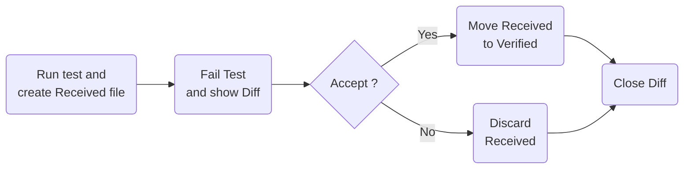
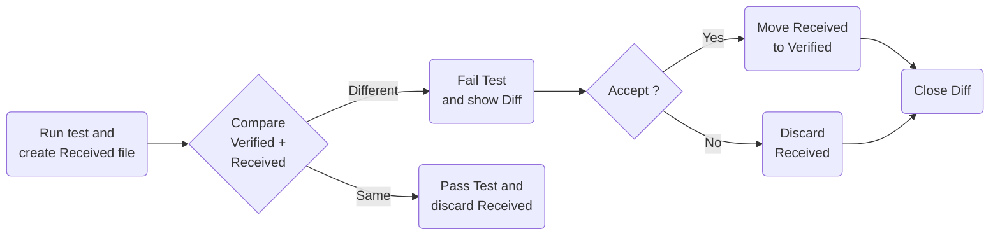

<!--
GENERATED FILE - DO NOT EDIT
This file was generated by [MarkdownSnippets](https://github.com/SimonCropp/MarkdownSnippets).
Source File: /readme.source.md
To change this file edit the source file and then run MarkdownSnippets.
-->

#  Verify

[](https://github.com/orgs/VerifyTests/discussions)
[](https://ci.appveyor.com/project/SimonCropp/Verify)
[](https://www.nuget.org/packages/Verify.Xunit/)
[](https://www.nuget.org/packages/Verify.NUnit/)
[](https://www.nuget.org/packages/Verify.Expecto/)
[](https://www.nuget.org/packages/Verify.MSTest/)
[](https://www.nuget.org/packages/Verify.ClipboardAccept/)

Verify is a snapshot tool that simplifies the assertion of complex data models and documents.

Verify is called on the test result during the assertion phase. It serializes that result and stores it in a file that matches the test name. On the next test execution, the result is again serialized and compared to the existing file. The test will fail if the two snapshots do not match: either the change is unexpected, or the reference snapshot needs to be updated to the new result.


## NuGet packages

 * https://nuget.org/packages/Verify.Xunit/
 * https://nuget.org/packages/Verify.NUnit/
 * https://nuget.org/packages/Verify.Expecto/
 * https://nuget.org/packages/Verify.MSTest/


## Snapshot management

Accepting or declining a snapshot file is part of the core workflow of Verify. There are several ways to do this and the approach(s) selected is a personal preference.

 * In the Windows Tray via [DiffEngineTray](https://github.com/VerifyTests/DiffEngine/blob/main/docs/tray.md)
 * [ReSharper test runner support](https://plugins.jetbrains.com/plugin/17241-verify-support) ([Source](https://github.com/matkoch/resharper-verify))
 * [Rider test runner support](https://plugins.jetbrains.com/plugin/17240-verify-support) ([Source](https://github.com/matkoch/resharper-verify))
 * [Via the clipboard](/docs/clipboard.md).
 * Manually making the change in the [launched diff tool](https://github.com/VerifyTests/DiffEngine#supported-tools). Either with a copy paste, or some tools have commands to automate this via a shortcut or a button.
 * Manually on the file system. By renaming the `.received.` file to `.verified.`. This can be automated via a scripted to bulk accept all (by matching a pattern) `.received.` files.
 * Using the dotnet tool [Verify.Terminal](https://github.com/VerifyTests/Verify.Terminal).


## Usage


### ImplicitUsings

**All examples use [ImplicitUsings](https://docs.microsoft.com/en-us/dotnet/core/project-sdk/msbuild-props#implicitusings). Ensure the following is set to have examples compile correctly `<ImplicitUsings>enable</ImplicitUsings>`**

If `ImplicitUsings` are not enabled, substitute usages of `Verify()` with `Verifier.Verify()`.


### Class being tested

Given a class to be tested:

<!-- snippet: ClassBeingTested -->
<a id='snippet-classbeingtested'></a>
```cs
public static class ClassBeingTested
{
    public static Person FindPerson() =>
        new()
        {
            Id = new("ebced679-45d3-4653-8791-3d969c4a986c"),
            Title = Title.Mr,
            GivenNames = "John",
            FamilyName = "Smith",
            Spouse = "Jill",
            Children = new()
            {
                "Sam",
                "Mary"
            },
            Address = new()
            {
                Street = "4 Puddle Lane",
                Country = "USA"
            }
        };
}
```
<sup><a href='/src/TargetLibrary/ClassBeingTested.cs#L1-L26' title='Snippet source file'>snippet source</a> | <a href='#snippet-classbeingtested' title='Start of snippet'>anchor</a></sup>
<!-- endSnippet -->


### xUnit

Support for [xUnit](https://xunit.net/)

<!-- snippet: SampleTestXunit -->
<a id='snippet-sampletestxunit'></a>
```cs
[UsesVerify]
public class Sample
{
    [Fact]
    public Task Test()
    {
        var person = ClassBeingTested.FindPerson();
        return Verify(person);
    }
}
```
<sup><a href='/src/Verify.Xunit.Tests/Snippets/Sample.cs#L1-L14' title='Snippet source file'>snippet source</a> | <a href='#snippet-sampletestxunit' title='Start of snippet'>anchor</a></sup>
<!-- endSnippet -->

 * [Verify Xunit Intro](https://www.youtube.com/watch?v=uGVogEltSkY)


### NUnit

Support for [NUnit](https://nunit.org/)

<!-- snippet: SampleTestNUnit -->
<a id='snippet-sampletestnunit'></a>
```cs
[TestFixture]
public class Sample
{
    [Test]
    public Task Test()
    {
        var person = ClassBeingTested.FindPerson();
        return Verify(person);
    }
}
```
<sup><a href='/src/Verify.NUnit.Tests/Snippets/Sample.cs#L1-L14' title='Snippet source file'>snippet source</a> | <a href='#snippet-sampletestnunit' title='Start of snippet'>anchor</a></sup>
<!-- endSnippet -->


### Expecto

Support for [Expecto](https://github.com/haf/expecto)

<!-- snippet: SampleTestExpecto -->
<a id='snippet-sampletestexpecto'></a>
```fs
open Expecto
open VerifyTests
open VerifyExpecto

[<Tests>]
let tests =
    testTask "findPerson" {
        let person = ClassBeingTested.FindPerson()
        do! Verifier.Verify("findPerson", person)
    }
```
<sup><a href='/src/Verify.Expecto.FSharpTests/Tests.fs#L2-L13' title='Snippet source file'>snippet source</a> | <a href='#snippet-sampletestexpecto' title='Start of snippet'>anchor</a></sup>
<!-- endSnippet -->


#### Caveats

Due to the nature of the Expecto implementation, the following APIs in Verify are not supported.

 * `settings.UseParameters()`
 * `settings.UseTextForParameters()`


### MSTest

Support for [MSTest](https://github.com/Microsoft/testfx-docs)

<!-- snippet: SampleTestMSTest -->
<a id='snippet-sampletestmstest'></a>
```cs
[TestClass]
public class Sample :
    VerifyBase
{
    [TestMethod]
    public Task Test()
    {
        var person = ClassBeingTested.FindPerson();
        return Verify(person);
    }
}
```
<sup><a href='/src/Verify.MSTest.Tests/Snippets/Sample.cs#L3-L17' title='Snippet source file'>snippet source</a> | <a href='#snippet-sampletestmstest' title='Start of snippet'>anchor</a></sup>
<!-- endSnippet -->


### Initial Verification

No existing `.verified.` file.



When the test is initially run will fail. If a [Diff Tool](https://github.com/VerifyTests/DiffEngine) is detected it will display the diff.


To verify the result:

 * Execute the command from the [Clipboard](/docs/clipboard.md), or
 * Accept with [DiffEngineTray tool](https://github.com/VerifyTests/DiffEngine/blob/master/docs/tray.md),
 * Accept with [ReSharper Addin](https://plugins.jetbrains.com/plugin/17241-verify-support) or [Rider Addin](https://plugins.jetbrains.com/plugin/17240-verify-support)
 * Use the diff tool to accept the changes, or
 * Manually copy the text to the new file


#### Verified result

This will result in the `Sample.Test.verified.txt` being created:

<!-- snippet: Verify.Xunit.Tests/Snippets/Sample.Test.verified.txt -->
<a id='snippet-Verify.Xunit.Tests/Snippets/Sample.Test.verified.txt'></a>
```txt
{
  GivenNames: John,
  FamilyName: Smith,
  Spouse: Jill,
  Address: {
    Street: 4 Puddle Lane,
    Country: USA
  },
  Children: [
    Sam,
    Mary
  ],
  Id: Guid_1
}
```
<sup><a href='/src/Verify.Xunit.Tests/Snippets/Sample.Test.verified.txt#L1-L14' title='Snippet source file'>snippet source</a> | <a href='#snippet-Verify.Xunit.Tests/Snippets/Sample.Test.verified.txt' title='Start of snippet'>anchor</a></sup>
<!-- endSnippet -->


### Subsequent Verification

Existing `.verified.` file.



If the implementation of `ClassBeingTested` changes:

<!-- snippet: ClassBeingTestedChanged -->
<a id='snippet-classbeingtestedchanged'></a>
```cs
public static class ClassBeingTested
{
    public static Person FindPerson() =>
        new()
        {
            Id = new("ebced679-45d3-4653-8791-3d969c4a986c"),
            Title = Title.Mr,
            // Middle name added
            GivenNames = "John James",
            FamilyName = "Smith",
            Spouse = "Jill",
            Children = new()
            {
                "Sam",
                "Mary"
            },
            Address = new()
            {
                // Address changed
                Street = "64 Barnett Street",
                Country = "USA"
            }
        };
}
```
<sup><a href='/src/TargetLibrary/ClassBeingTestedChanged.cs#L3-L30' title='Snippet source file'>snippet source</a> | <a href='#snippet-classbeingtestedchanged' title='Start of snippet'>anchor</a></sup>
<!-- endSnippet -->

And the test is re run it will fail.


#### The [Diff Tool](https://github.com/VerifyTests/DiffEngine) will display the diff:


The same approach can be used to verify the results and the change to `Sample.Test.verified.txt` is committed to source control along with the change to `ClassBeingTested`.


### VerifyJson

`VerifyJson` performs the following actions

 * Convert to `JToken` (if necessary).
 * Apply [ignore member by name](/docs/serializer-settings.md#ignore-member-by-name) for keys.
 * PrettyPrint the resulting text.

<!-- snippet: VerifyJson -->
<a id='snippet-verifyjson'></a>
```cs
[Fact]
public Task VerifyJsonString()
{
    var json = "{'key': {'msg': 'No action taken'}}";
    return VerifyJson(json);
}

[Fact]
public Task VerifyJsonStream()
{
    var json = "{'key': {'msg': 'No action taken'}}";
    var stream = new MemoryStream(Encoding.UTF8.GetBytes(json));
    return VerifyJson(stream);
}

[Fact]
public Task VerifyJsonJToken()
{
    var json = "{'key': {'msg': 'No action taken'}}";
    var target = JToken.Parse(json);
    return Verify(target);
}
```
<sup><a href='/src/Verify.Tests/JsonTests.cs#L169-L194' title='Snippet source file'>snippet source</a> | <a href='#snippet-verifyjson' title='Start of snippet'>anchor</a></sup>
<!-- endSnippet -->

Results in:

<!-- snippet: JsonTests.VerifyJsonString.verified.txt -->
<a id='snippet-JsonTests.VerifyJsonString.verified.txt'></a>
```txt
{
  key: {
    msg: No action taken
  }
}
```
<sup><a href='/src/Verify.Tests/JsonTests.VerifyJsonString.verified.txt#L1-L5' title='Snippet source file'>snippet source</a> | <a href='#snippet-JsonTests.VerifyJsonString.verified.txt' title='Start of snippet'>anchor</a></sup>
<!-- endSnippet -->


## Source control: Received and Verified files


### Received

 * **All `*.received.*` files should be excluded from source control.**

eg. add the following to `.gitignore`

```
*.received.*
```

If using [UseSplitModeForUniqueDirectory](/docs/naming.md#usesplitmodeforuniquedirectory) also include:

`*.received/`


### Verified

All `*.verified.*` files should be committed to source control.

All text extensions of  `*.verified.*` and have eol set to `lf`.

eg add the following to `.gitattributes`

```
*.verified.txt text eol=lf
*.verified.xml text eol=lf
*.verified.json text eol=lf
```


## Static settings

Most settings are available at the both global level and at the instance level.

When modifying settings at the both global level it should be done using a Module Initializer:

<!-- snippet: StaticSettings.cs -->
<a id='snippet-StaticSettings.cs'></a>
```cs
[UsesVerify]
public class StaticSettings
{
    [Fact]
    public Task Test() =>
        Verify("String to verify");
}

public static class StaticSettingsUsage
{
    [ModuleInitializer]
    public static void Initialize() =>
        VerifierSettings.AddScrubber(_ => _.Replace("String to verify", "new value"));
}
```
<sup><a href='/src/Verify.Tests/StaticSettings.cs#L1-L14' title='Snippet source file'>snippet source</a> | <a href='#snippet-StaticSettings.cs' title='Start of snippet'>anchor</a></sup>
<!-- endSnippet -->


## VerifyResult

In some scenarios it can be helpful to get access to the resulting `*.verified.*` files after a successful run. For example to do an explicit check for contains or not-contains in the resulting text. To allow this all Verify methods return a `VerifyResult`.

<!-- snippet: VerifyResult -->
<a id='snippet-verifyresult'></a>
```cs
var result = await Verify(
    new
    {
        Property = "Value To Check"
    });
Assert.Contains("Value To Check", result.Text);
```
<sup><a href='/src/Verify.Tests/Tests.cs#L313-L322' title='Snippet source file'>snippet source</a> | <a href='#snippet-verifyresult' title='Start of snippet'>anchor</a></sup>
<!-- endSnippet -->

If using `Verifier.Throws`, the resulting `Exception` will also be accessible

<!-- snippet: ExceptionResult -->
<a id='snippet-exceptionresult'></a>
```cs
var result = await Verifier.Throws(MethodThatThrows);
Assert.NotNull(result.Exception);
```
<sup><a href='/src/Verify.Tests/ThrowsTests.cs#L100-L105' title='Snippet source file'>snippet source</a> | <a href='#snippet-exceptionresult' title='Start of snippet'>anchor</a></sup>
<!-- endSnippet -->


## CurrentFile

Utility for finding paths based on the current file.

<!-- snippet: CurrentFile.cs -->
<a id='snippet-CurrentFile.cs'></a>
```cs
using IOPath = System.IO.Path;

namespace VerifyTests;

public static class CurrentFile
{
    public static string Path([CallerFilePath] string file = "") =>
        file;

    public static string Directory([CallerFilePath] string file = "") =>
        IOPath.GetDirectoryName(file)!;

    public static string Relative(string relative, [CallerFilePath] string file = "")
    {
        var directory = IOPath.GetDirectoryName(file)!;
        return IOPath.Combine(directory, relative);
    }
}
```
<sup><a href='/src/Verify/CurrentFile.cs#L1-L18' title='Snippet source file'>snippet source</a> | <a href='#snippet-CurrentFile.cs' title='Start of snippet'>anchor</a></sup>
<!-- endSnippet -->


## Versioning

Verify follows [Semantic Versioning](https://semver.org/). The same applies for [extensions to Verify](#extensions). Small changes in the resulting snapshot files may be deployed in a minor version. As such nuget updates to `Verify.*` should be done as follows:

 * Updates all `Verify.*`packages in isolation
 * Re-run all tests.
 * If there are changes, ensure they look correct given the release notes. If the changes do not look correct, raise an issue.
 * Accept those changes.

Snapshot changes do not trigger a major version change to avoid causing [Diamond dependency](https://en.wikipedia.org/wiki/Dependency_hell#Problems) issues for downstream extensions.


## Media

 * [Unit testing assertions are now easier than ever with Verify Snapshot tool - 
Rana Krishnrajsinh (20 October 2022)](https://www.youtube.com/watch?v=T1ZPGi_dHFM)
 * [The easiest way to Unit Test with Verify in C# - 
Tomasz Juszczak (6 September 2022)](https://prographers.com/blog/the-easiest-way-to-unit-test-with-verify-in-c)
 * [Testing C# code reliably by freezing it in time - 
Nick Chapsas (1 August 2022)](https://www.youtube.com/watch?v=Q1_YkcPwpqY)
 * [Snapshot Testing in .NET with Verify - Dan Clarke (21 July 2022)](https://www.youtube.com/watch?v=wA7oJDyvn4c&t=1s)
 * [Testing an incremental generator with snapshot testing (14 Dec 2021)](https://andrewlock.net/creating-a-source-generator-part-2-testing-an-incremental-generator-with-snapshot-testing/)
 * [Snapshot Testing with Verify - Dan Clarke (10 Dec 2021)](https://www.danclarke.com/snapshot-testing-with-verify)
 * [OSS Power-Ups: Verify (14 Jul 2021)](https://www.youtube.com/watch?v=ZD5-51iCmU0)
 * [Unhandled Exception podcast: Snapshot Testing (26 Nov 2021)](https://unhandledexceptionpodcast.com/posts/0029-snapshottesting/)
 * [5 helpful Nuget package for Unit Testing in .NET (16 Oct 2021)](https://medium.com/@niteshsinghal85/5-helpful-nuget-package-for-unit-testing-in-net-87c2e087c6d)
 * [5 open source .NET projects that deserve more attention (9 Sep 2021)](https://www.youtube.com/watch?v=mwHWPoKEmyY&t=515s)
 * [Verify: Snapshot Testing for C# (23rd Nov. 2020)](https://rowell.heria.uk/blog/2020/11/23/verify-snapshot-testing-for-c)
 * [Verify Xunit Intro (26 Apr 2020)](https://www.youtube.com/watch?v=uGVogEltSkY)


## Extensions

 * [Verify.AngleSharp](https://github.com/VerifyTests/Verify.AngleSharp): Html verification utilities via [AngleSharp](https://github.com/AngleSharp/AngleSharp).
 * [Verify.AspNetCore](https://github.com/VerifyTests/Verify.AspNetCore): Verification of AspNetCore bits.
 * [Verify.Aspose](https://github.com/VerifyTests/Verify.Aspose): Verification of documents (pdf, docx, xslx, and pptx) via Aspose.
 * [Verify.Blazor](https://github.com/VerifyTests/Verify.Blazor): Verification of [Blazor Component](https://docs.microsoft.com/en-us/aspnet/core/blazor/#components) via [bunit](https://bunit.egilhansen.com) or via raw Blazor rendering.
 * [Verify.Cosmos](https://github.com/VerifyTests/Verify.Cosmos): Verification of [Azure CosmosDB](https://docs.microsoft.com/en-us/azure/cosmos-db/).
 * [Verify.DiffPlex](https://github.com/VerifyTests/Verify.DiffPlex): Comparison of text via [DiffPlex](https://github.com/mmanela/diffplex).
 * [Verify.DocNet](https://github.com/VerifyTests/Verify.DocNet): Verification of pdfs via [DocNet](https://github.com/GowenGit/docnet).
 * [Verify.EntityFramework](https://github.com/VerifyTests/Verify.EntityFramework): Verification of EntityFramework bits.
 * [Verify.FakeItEasy](https://github.com/VerifyTests/Verify.FakeItEasy): Verification of [FakeItEasy](https://fakeiteasy.github.io/) bits.
 * [Verify.HeadlessBrowsers](https://github.com/VerifyTests/Verify.HeadlessBrowsers): Verification of Web UIs using [Playwright](https://github.com/microsoft/playwright-sharp), [Puppeteer Sharp](https://github.com/hardkoded/puppeteer-sharp), or [Selenium](https://www.selenium.dev).
 * [Verify.Http](https://github.com/VerifyTests/Verify.Http): Verification of Http bits.
 * [Verify.ICSharpCode.Decompiler](https://github.com/VerifyTests/Verify.ICSharpCode.Decompiler): Comparison of assemblies and types via [ICSharpCode.Decompiler](https://github.com/icsharpcode/ILSpy/wiki/Getting-Started-With-ICSharpCode.Decompiler).
 * [Verify.ImageHash](https://github.com/VerifyTests/Verify.ImageHash): Comparison of images via [ImageHash](https://github.com/coenm/ImageHash).
 * [Verify.ImageSharp.Compare](https://github.com/VerifyTests/Verify.ImageSharp.Compare): Verification and comparison of images via [Codeuctivity.ImageSharp.Compare](https://github.com/Codeuctivity/ImageSharp.Compare).
 * [Verify.ImageMagick](https://github.com/VerifyTests/Verify.ImageMagick): Verification and comparison of images via [Magick.NET](https://github.com/dlemstra/Magick.NET).
 * [Verify.ImageSharp](https://github.com/VerifyTests/Verify.ImageSharp): Verification of images via [ImageSharp](https://github.com/SixLabors/ImageSharp).
 * [Verify.MassTransit](https://github.com/VerifyTests/Verify.MassTransit): Support for MassTransit test helpers.
 * [Verify.MicrosoftLogging](https://github.com/VerifyTests/Verify.MicrosoftLogging): Verify MicrosoftLogging.
 * [Verify.MongoDB](https://github.com/flcdrg/Verify.MongoDB): Verification of [MongoDB](https://www.mongodb.com/) bits.
 * [Verify.Moq](https://github.com/VerifyTests/Verify.Moq): Verification of [Moq](https://github.com/moq/moq4) bits.
 * [Verify.NodaTime](https://github.com/VerifyTests/Verify.NodaTime): Support for [NodaTime](https://nodatime.org/).
 * [Verify.NewtonsoftJson](https://github.com/VerifyTests/Verify.NewtonsoftJson): Support for converting [Newtonsoft.Json](https://github.com/JamesNK/Newtonsoft.Json) types (JObject and JArray).
 * [Verify.NServiceBus](https://github.com/VerifyTests/Verify.NServiceBus): Verify NServiceBus Test Contexts.
 * [Verify.NSubstitute](https://github.com/VerifyTests/Verify.NSubstitute): Support for [NSubstitute](https://nsubstitute.github.io/) types
 * [Verify.PdfPig](https://github.com/VerifyTests/Verify.PdfPig): Verification of pdfs via [PdfPig](https://github.com/UglyToad/PdfPig).
 * [Verify.Phash](https://github.com/VerifyTests/Verify.Phash): Comparison of images via [Phash](https://github.com/pgrho/phash).
 * [Verify.Quibble](https://github.com/VerifyTests/Verify.Quibble): Comparison of objects via [Quibble](https://github.com/nrkno/Quibble).
 * [Verify.QuestPDF](https://github.com/VerifyTests/Verify.QuestPDF): Verification of pdf documents via [QuestPDF](https://www.questpdf.com/).
 * [Verify.RavenDb](https://github.com/VerifyTests/Verify.RavenDb): Verification of [RavenDb](https://ravendb.net) bits.
 * [Verify.Serilog](https://github.com/VerifyTests/Verify.Serilog): Verification of Serilog bits.
 * [Verify.SqlServer](https://github.com/VerifyTests/Verify.SqlServer): Verification of SqlServer bits.
 * [Verify.SourceGenerators](https://github.com/VerifyTests/Verify.SourceGenerators): Verification of C# Source Generators.
 * [Verify.SystemJson](https://github.com/VerifyTests/Verify.SystemJson): Support for converting System.Text.Json types.
 * [Verify.Terminal](https://github.com/VerifyTests/Verify.Terminal): A dotnet tool for managing Verify snapshots.
 * [Verify.WinForms](https://github.com/VerifyTests/Verify.WinForms): Verification of WinForms UIs.
 * [Verify.Xamarin](https://github.com/VerifyTests/Verify.Xamarin): Verification of Xamarin UIs.
 * [Verify.Xaml](https://github.com/VerifyTests/Verify.Xaml): Verification of Xaml UIs.
 * [Spectre.Verify.Extensions](https://github.com/spectresystems/spectre.verify.extensions): Add an attribute driven file naming convention to Verify.
 * [Verify.Syncfusion](https://github.com/VerifyTests/Verify.Syncfusion): Verification of documents (pdf, docx, xslx, and pptx) via [Syncfusion File Formats](https://help.syncfusion.com/file-formats/introduction).


## More Documentation

  * [Clipboard](/docs/clipboard.md) <!-- include: doc-index. path: /docs/mdsource/doc-index.include.md -->
  * [Compared to assertions](/docs/compared-to-assertion.md)
  * [Verify options](/docs/verify-options.md)
  * [VerifyDirectory](/docs/verify-directory.md)
  * [VerifyFile](/docs/verify-file.md)
  * [VerifyXml](/docs/verify-xml.md)
  * [Serializer Settings](/docs/serializer-settings.md)
  * [File naming](/docs/naming.md)
  * [Parameterised tests](/docs/parameterised.md)
  * [Named Tuples](/docs/named-tuples.md)
  * [Scrubbers](/docs/scrubbers.md)
  * [Diff Engine](https://github.com/VerifyTests/DiffEngine)
  * [Diff Tools](https://github.com/VerifyTests/DiffEngine/blob/master/docs/diff-tool.md)
  * [Diff Tool Order](https://github.com/VerifyTests/DiffEngine/blob/master/docs/diff-tool.order.md)
  * [Custom Diff Tool](https://github.com/VerifyTests/DiffEngine/blob/master/docs/diff-tool.custom.md)
  * [Using anonymous types](/docs/anonymous-types.md)
  * [Verifying binary data](/docs/binary.md)
  * [Build server](/docs/build-server.md)
  * [Comparers](/docs/comparer.md)
  * [Converters](/docs/converter.md)
  * [Explicit Targets](/docs/explicit.ms)
  * [FSharp Usage](/docs/fsharp.md)
  * [Compared to ApprovalTests](/docs/compared-to-approvaltests.md) <!-- endInclude -->


## Icon

[Helmet](https://thenounproject.com/term/helmet/9554/) designed by [Leonidas Ikonomou](https://thenounproject.com/alterego) from [The Noun Project](https://thenounproject.com).
