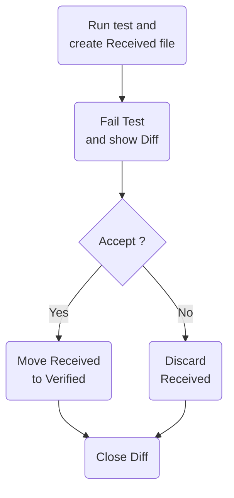
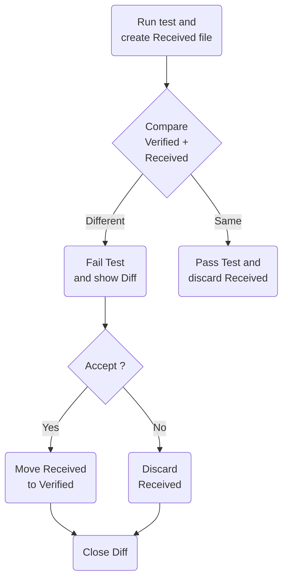

#  Verify

[](https://github.com/orgs/VerifyTests/discussions)
[](https://ci.appveyor.com/project/SimonCropp/Verify)
[](https://www.nuget.org/packages/Verify.NUnit/)
[](https://www.nuget.org/packages/Verify.Xunit/)
[](https://www.nuget.org/packages/Verify.XunitV3/)
[](https://www.nuget.org/packages/Verify.Fixie/)
[](https://www.nuget.org/packages/Verify.Expecto/)
[](https://www.nuget.org/packages/Verify.MSTest/)
[](https://www.nuget.org/packages/Verify.TUnit/)
[](https://www.nuget.org/packages/Verify.ClipboardAccept/)

include: intro

**See [Milestones](../../milestones?state=closed) for release notes.**


## Sponsors

include: zzz


### JetBrains

[](https://jb.gg/OpenSourceSupport)


## Requirements

 * Supported runtimes: net472, net48, net481, net6, net8, net9, and net10.
 * Supported SDK: 9.0.301 and up


## [Getting started wizard](/docs/wiz/readme.md)

Get customized instructions for the specific combination of Operating System, IDE, Test Framework, and Build Server.

[Start wizard](/docs/wiz/readme.md).


## NuGet

* https://nuget.org/packages/Verify.NUnit/
* https://nuget.org/packages/Verify.Xunit/
* https://nuget.org/packages/Verify.XunitV3/
* https://nuget.org/packages/Verify.Fixie/
* https://nuget.org/packages/Verify.Expecto/
* https://nuget.org/packages/Verify.MSTest/
* https://nuget.org/packages/Verify.TUnit/


## Snapshot management

Accepting or declining a snapshot file is part of the core workflow of Verify. There are several ways to do this and the
approach(s) selected is a personal preference.

* In the Windows Tray via [DiffEngineTray](https://github.com/VerifyTests/DiffEngine/blob/main/docs/tray.md)
* [ReSharper test runner plugin](https://plugins.jetbrains.com/plugin/17241-verify-support) ([Source](https://github.com/matkoch/resharper-verify))
* [Rider test runner plugin](https://plugins.jetbrains.com/plugin/17240-verify-support) ([Source](https://github.com/matkoch/resharper-verify))
* [Via the clipboard](/docs/clipboard.md).
* Manually making the change in the [launched diff tool](https://github.com/VerifyTests/DiffEngine#supported-tools).
  Either with a copy paste, or some tools have commands to automate this via a shortcut or a button.
* Manually on the file system, by renaming the `.received.` file to `.verified.`. This can be automated via scripts to bulk accept all `.received.` files by matching a pattern.
* Using the dotnet tool [Verify.Terminal](https://github.com/VerifyTests/Verify.Terminal).


## Usage


### ImplicitUsings

include: implicit-usings


### Class being tested

Given a class to be tested:

snippet: ClassBeingTested


### NUnit

Support for [NUnit](https://nunit.org/)

snippet: SampleTestNUnit


### xUnit

Support for [xUnit](https://xunit.net/)

snippet: SampleTestXunit


### xUnitV3

Support for [xUnitV3](https://xunit.net/)

snippet: SampleTestXunitV3


### Fixie

Support for [Fixie](http://fixie.github.io/)

snippet: SampleTestFixie

include: fixie-convention


### Expecto

Support for [Expecto](https://github.com/haf/expecto)

snippet: SampleTestExpecto


#### Caveats

Due to the nature of the Expecto implementation, the following APIs in Verify are not supported.

* `settings.UseParameters()`
* `settings.UseTextForParameters()`


### TUnit

Support for [TUnit](https://github.com/thomhurst/TUnit)

snippet: SampleTestTUnit


### MSTest

Support for [MSTest](https://github.com/Microsoft/testfx-docs)

snippet: SampleTestMSTest


#### Marking tests as 'Using Verify'

include: mstest-marker


### Initial Verification

No existing `.verified.` file.



When the test is initially run it will fail. If a [Diff Tool](https://github.com/VerifyTests/DiffEngine) is detected it will be used to display the diff.


To verify the result:

* Execute the command from the [Clipboard](/docs/clipboard.md), or
* Accept with [DiffEngineTray tool](https://github.com/VerifyTests/DiffEngine/blob/master/docs/tray.md),
* Accept with [ReSharper Plugin](https://plugins.jetbrains.com/plugin/17241-verify-support) or [Rider Plugin](https://plugins.jetbrains.com/plugin/17240-verify-support)
* Use the diff tool to accept the changes, or
* Manually copy the text to the new file


#### Verified result

This will result in the `Sample.Test.verified.txt` being created:

snippet: Verify.Xunit.Tests/Snippets/Sample.Test.verified.txt


### Subsequent Verification

Existing `.verified.` file.



If the implementation of `ClassBeingTested` changes:

snippet: ClassBeingTestedChanged

And the test is re-run it will fail.


#### The [Diff Tool](https://github.com/VerifyTests/DiffEngine) will display the diff:


The same approach can be used to verify the results and the change to `Sample.Test.verified.txt` is committed to source control along with the change to `ClassBeingTested`.


### Async

`Verify()` has overloads that accept `Task<T>`, `ValueTask<T>`, and `IAsyncEnumerable<T>`. These are `await`ed before verification.

There is also an overload that accepts `Func<Task<T>>`, which works well with `async` lambda expressions:

snippet: VerifyFuncOfTaskOfT


### VerifyJson

`VerifyJson` performs the following actions

* Convert to `JToken` (if necessary).
* Apply [ignore member by name](/docs/serializer-settings.md#ignore-member-by-name) for keys.
* PrettyPrint the resulting text.

snippet: VerifyJson

Results in a .txt file:

snippet: JsonTests.VerifyJsonString.verified.txt


## Conventions


### Source control Includes/Excludes

include: include-exclude


### Text file settings

include: text-file-settings


### Conventions check

The above conventions can be checked by calling `VerifyChecks.Run()` in a test


#### MSTest

snippet: VerifyChecksMSTest


#### Expecto

snippet: VerifyChecksExpecto


#### Fixie

snippet: VerifyChecksFixie


#### Xunit

snippet: VerifyChecksXunit


#### XunitV3

snippet: VerifyChecksXunitV3


#### NUnit

snippet: VerifyChecksNUnit


#### TUnit

snippet: VerifyChecksTUnit


## Static settings

Most settings are available at both the global level and at the instance level.

When modifying settings at the global level it should be done using a [Module Initializer](https://learn.microsoft.com/en-us/dotnet/csharp/language-reference/proposals/csharp-9.0/module-initializers):

snippet: StaticSettings.cs

In .net framework, where the Module Initializer feature is not enabled by default, either use a Polyfill package (eg https://github.com/SimonCropp/Polyfill) or add the following to the test project:

```csharp
namespace System.Runtime.CompilerServices;

[AttributeUsage(AttributeTargets.Method, AllowMultiple = false)]
public sealed class ModuleInitializerAttribute : Attribute;
```

Alternatively, place static settings in the "run once before all test" API of the test framework being used.


## VerifyResult

In some scenarios it can be helpful to get access to the resulting `*.verified.*` files after a successful run. For example to do an explicit check for contains or not-contains in the resulting text. To allow this all Verify methods return a `VerifyResult`.

snippet: VerifyResult

If using `Verifier.Throws`, the resulting `Exception` will also be accessible

snippet: ExceptionResult


## CurrentFile

Utility for finding paths based on the current file.

snippet: CurrentFile.cs


## Versioning

Verify follows [Semantic Versioning](https://semver.org/). The same applies for [extensions to Verify](#extensions). Small changes in the resulting snapshot files may be deployed in a minor version. As such nuget updates to `Verify.*` should be done as follows:

* Update all `Verify.*`packages in isolation
* Re-run all tests.
* If there are changes, ensure they look correct given the release notes. If the changes do not look correct, raise an issue.
* Accept the changes.

Snapshot changes do not trigger a major version change to avoid causing [Diamond dependency](https://en.wikipedia.org/wiki/Dependency_hell#Problems) issues for downstream extensions.


## Unit testing inside virtualized environment

Unit tests referencing `Verify` (including unit tests within this repository as well as any other code referencing `Verify`) can be run and debugged on a local virtualized environment supported by [Visual Studio Remote Testing](https://learn.microsoft.com/en-us/visualstudio/test/remote-testing?view=vs-2022). Initial configurations have been added for `WSL` and net 7.0 linux docker via `testenvironments.json` (for third party code, the file needs to be copied or recreated next to the `.sln` solution file for solution to leverage the functionality).

Upon opening the Tests Explorer the advanced environments are available in the GUI:


This readme will not discuss definitive list of details for proper setup of the environments instead refer the following information sources and warn about particular gotchas:

* WSL runs
    * Install [WSL](https://learn.microsoft.com/en-us/windows/wsl/about).
    * Install a [distribution](https://aka.ms/wslstore).
    * [Install .NET Runtime](https://learn.microsoft.com/en-us/dotnet/core/install/linux-ubuntu)
* Docker runs
    * Install [Docker Desktop](https://www.docker.com/products/docker-desktop/)
    * First run of docker scenario might need elevation ([Test project does not reference any .NET NuGet adapter](https://developercommunity.visualstudio.com/t/test-project-does-not-reference-any-net-nuget-adap/1311698) error)
* Third party test runners might not support this feature.
  Use [Visual Studio Test Explorer](https://learn.microsoft.com/en-us/visualstudio/test/run-unit-tests-with-test-explorer).


## Media


### Blogs

* [Verify.Cli - Snapshot testing without tests - David Gardiner (21 Jul 2025)](https://david.gardiner.net.au/2025/07/verify-cli)
* [Snapshot testing .NET code with Verify - David Gardiner (21 Jul 2025)](https://david.gardiner.net.au/2025/07/verify)
* [Library: Verify - Snapshot Testing - Simplify Complex Object Testing (2 Jan 2025)](https://vukvuk.com/posts/library-verify-and-snapshot-testing)
* [Snapshot Testing in .NET with Verify - Khalid Abuhakmeh (12 Jul 2024)](https://blog.jetbrains.com/dotnet/2024/07/11/snapshot-testing-in-net-with-verify/)
* [Snapshot testing in C# with Verify - Tim Deschryver (21 Feb 2024)](https://timdeschryver.dev/bits/snapshot-testing-in-c-with-verify)
* [Snapshot Testing in C# - William Rees (13 Feb 2024)](https://wil-rees.medium.com/snapshot-testing-with-verify-xunit-f1ae5127b800)
* [I want to do a snapshot test with C# (26 Dec 2023)](https://zzzkan.me/blog/verify-tests/)
* [I REGRET Not Telling Dave Farley THIS about Approval Testing - Emily Bache (27 Sep 2023)](https://www.youtube.com/watch?v=jOuqE_o9rmg)
* [Today's random F# code: Using Verify to prevent breaking changes in stored data - Urs Enzler (31 Mar 2023)](https://www.planetgeek.ch/2023/03/31/todays-random-f-code-using-verify-to-prevent-breaking-changes-in-stored-data/)
* [Compare object values in xUnit C# with Verify - Pierre Belin (18 Nov 2022)](https://pierrebelin.medium.com/compare-object-values-in-xunit-c-with-verify-215d02b4ed39/)
* [Unit testing assertions are now easier than ever with Verify Snapshot tool - Rana Krishnrajsinh (5 Nov 2022)](https://www.youtube.com/watch?v=T1ZPGi_dHFM)
* [The easiest way to Unit Test with Verify in C# - Tomasz Juszczak (6 Sep 2022)](https://prographers.com/blog/the-easiest-way-to-unit-test-with-verify-in-c)
* [Snapshot testing Verify.MongoDB: David Gardiner (31 Mar 2022)](https://david.gardiner.net.au/2022/03/verify-mongodb.html)
* [Testing an incremental generator with snapshot testing (14 Dec 2021)](https://andrewlock.net/creating-a-source-generator-part-2-testing-an-incremental-generator-with-snapshot-testing/)
* [5 helpful Nuget package for Unit Testing in .NET (16 Oct 2021)](https://medium.com/@niteshsinghal85/5-helpful-nuget-package-for-unit-testing-in-net-87c2e087c6d)
* [Snapshot Testing with Verify: Carl Franklin's Blazor Train (3 Apr 2020)](https://rowell.heria.uk/blog/2020/11/23/verify-snapshot-testing-for-c)
* [Verify: Snapshot Testing for C# (23 Nov 2020)](https://rowell.heria.uk/blog/2020/11/23/verify-snapshot-testing-for-c)


### Podcasts

* [Accessibilité, Azure Storage Action, Golden Master et Agentic AI (15 Jan 2025)](https://devdevdev.net/tr01-2025-accessibilite-azure-storage-action-golden-master-et-agentic-ai/)
* [Adventures in .NET: Mastering Dotnet Testing: Using Verify to Minimize Assertions (2 Jul 2024)](https://topenddevs.com/podcasts/adventures-in-net/episodes/mastering-dotnet-testing-using-verify-to-minimize-assertions-net-192)
* [Unhandled Exception podcast: Snapshot Testing (26 Nov 2021)](https://unhandledexceptionpodcast.com/posts/0029-snapshottesting/)
* [Snapshot Testing with Verify - Dan Clarke (10 Dec 2021)](https://www.danclarke.com/snapshot-testing-with-verify)


### Videos

* [Testing complex data with Verify - Lars Furu Kjelsaas (9 Jul 2025)](https://www.youtube.com/watch?v=plBmSjs8_bY)
* [The Only Type of Testing U Need - Nick Chapsas (12 Nov 2024)](https://www.youtube.com/watch?v=JG4zt9CnIl4)
* [Introduction to Snapshot testing and using Verify.Xunit - Betatalks (11 Oct 2023)](https://www.youtube.com/watch?v=RVmz3FZFIBU)
* [The Way to Test Legacy Code in C# - Gui Ferreira (19 Sep 2023)](https://www.youtube.com/watch?v=UC-AUnuTh0I)
* [Snapshot Testing in .NET with Verify - Dan Clarke (21 Jul 2022)](https://www.youtube.com/watch?v=wA7oJDyvn4c&t=1s)
* [Testing C# code reliably by freezing it in time - Nick Chapsas (1 Aug 2022)](https://www.youtube.com/watch?v=Q1_YkcPwpqY)
* [5 open source .NET projects that deserve more attention (9 Sep 2021)](https://www.youtube.com/watch?v=mwHWPoKEmyY&t=515s)
* [OSS Power-Ups: Verify (14 Jul 2021)](https://www.youtube.com/watch?v=ZD5-51iCmU0)
* [Verify Xunit Intro (26 Apr 2020)](https://www.youtube.com/watch?v=uGVogEltSkY)


## Plugins

include: plugin-list


## More Documentation

include: doc-index


## Icon

[Helmet](https://thenounproject.com/term/helmet/9554/) designed by [Leonidas Ikonomou](https://thenounproject.com/alterego) from [The Noun Project](https://thenounproject.com).
